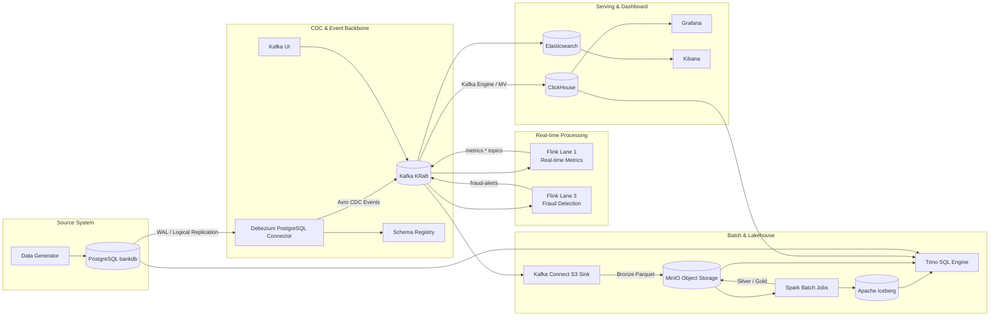

# Fintech Real-time CDC & Lakehouse Platform

<p align="center">
  <strong>PostgreSQL CDC → Kafka → Flink → ClickHouse/Grafana → Elasticsearch/Kibana → MinIO/Spark/Iceberg/Trino</strong>
</p>

<p align="center">
  
  
  
  
  
</p>

## 1. Tổng quan dự án

Dự án này mô phỏng một **nền tảng dữ liệu ngân hàng gần thời gian thực**. Hệ thống bắt đầu từ cơ sở dữ liệu giao dịch PostgreSQL, sử dụng **Debezium CDC** để bắt thay đổi từ WAL, đẩy sự kiện vào **Kafka**, sau đó tách thành nhiều lane xử lý khác nhau:

- **Real-time analytics:** Flink xử lý transaction stream và tạo KPI, time series, breakdown, top-N account.
- **Operational dashboard:** ClickHouse lưu metrics tốc độ cao, Grafana trực quan hóa.
- **Fraud detection:** Flink phát hiện hành vi bất thường và phát alert vào Kafka.
- **Search & investigation:** Elasticsearch/Kibana phục vụ tra cứu customers, accounts, transactions, transfers và fraud alerts.
- **Lakehouse batch layer:** Kafka Connect S3 Sink ghi raw CDC vào MinIO, Spark enrich dữ liệu và xây dựng Silver/Gold layer, Iceberg cung cấp table format có snapshot/time travel, Trino phục vụ truy vấn liên kết.
- **Data reliability:** DLQ processor được thiết kế để theo dõi các message lỗi từ Kafka Connect.

Dự án phù hợp để trình bày năng lực về **Data Engineering, CDC, Streaming, Lakehouse, Batch Processing, Monitoring và hệ thống dữ liệu production-like trên Docker Compose**.

---

## 2. Kiến trúc tổng quan

> 📸 **Ảnh cần chèn:** `docs/images/01-architecture-overview.png`  
> Gợi ý chụp/tạo ảnh: sơ đồ tổng thể toàn bộ pipeline từ PostgreSQL → Kafka → các lane xử lý → serving/lakehouse/monitoring.



Dự án hiện có sẵn file `data_flow.png` trong thư mục gốc. Có thể dùng file này làm hình kiến trúc ban đầu hoặc thay bằng ảnh mới rõ hơn.

```md

```

---

## 3. Mục tiêu kỹ thuật

| Nhóm mục tiêu | Nội dung |
|---|---|
| CDC | Bắt thay đổi từ PostgreSQL bằng Debezium dựa trên logical replication/WAL. |
| Streaming | Xử lý transaction stream bằng Flink với event-time, watermark và checkpoint. |
| Real-time serving | Ghi metrics vào Kafka topic, ClickHouse consume bằng Kafka Engine + Materialized View. |
| Fraud detection | Phát hiện velocity fraud và failed storm theo account/window. |
| Search | Đẩy CDC và fraud alert sang Elasticsearch để tra cứu trên Kibana. |
| Lakehouse | Ghi raw CDC dạng Parquet vào MinIO Bronze, Spark build Silver/Gold, Iceberg quản lý table/snapshot. |
| Query federation | Dùng Trino để truy vấn PostgreSQL, ClickHouse và Iceberg/MinIO. |
| Reliability | Thiết kế DLQ processor để phân loại lỗi transient/permanent/unknown. |

---

## 4. Luồng dữ liệu chính

### 4.1 Source → CDC → Kafka

PostgreSQL đóng vai trò **source database** với các bảng ngân hàng:

- `customers`
- `accounts`
- `transactions`
- `transfers`

Debezium PostgreSQL Connector đọc WAL thông qua publication `dbz_publication` và replication slot `debezium_slot`, sau đó publish CDC event vào Kafka theo các topic:

```text
bankdb.public.customers
bankdb.public.accounts
bankdb.public.transactions
bankdb.public.transfers
```

> 📸 **Ảnh cần chèn:** `docs/images/02-kafka-topics.png`  
> Gợi ý chụp: Kafka UI hiển thị các topic `bankdb.public.*`, `metrics.*`, `fraud-alerts`.

### 4.2 Lane 1 — Real-time Metrics

Flink đọc topic `bankdb.public.transactions`, xử lý event-time và ghi kết quả ra các topic metrics:

```text
metrics.timeseries
metrics.kpi
metrics.breakdown
metrics.topn
```

ClickHouse consume các topic này bằng Kafka Engine, sau đó Materialized View ghi vào bảng serving:

```text
metrics.timeseries
metrics.kpi
metrics.breakdown
metrics.topn
```

Grafana kết nối ClickHouse để dựng dashboard realtime.

> 📸 **Ảnh cần chèn:** `docs/images/03-grafana-dashboard.png`  
> Gợi ý chụp: dashboard Grafana gồm transaction count, success rate, failed count, top accounts, volume theo thời gian.

### 4.3 Lane 3 — Fraud Detection

Flink Fraud job đọc transaction stream và phát hiện hai nhóm cảnh báo:

| Alert type | Ý nghĩa |
|---|---|
| `VELOCITY_FRAUD` | Một account có số lượng giao dịch vượt ngưỡng trong một window ngắn. |
| `FAILED_STORM` | Một account có nhiều giao dịch failed trong sliding window. |

Alert được ghi vào Kafka topic:

```text
fraud-alerts
```

Sau đó fraud alert có thể được đẩy sang Elasticsearch để điều tra trên Kibana và được Fraud Notifier gửi cảnh báo qua email.

> 📸 **Ảnh cần chèn:** `docs/images/04-fraud-alerts-kibana.png`  
> Gợi ý chụp: Kibana Discover hoặc Dashboard hiển thị index fraud alert.

### 4.4 Lakehouse — Bronze, Silver, Gold

Kafka Connect S3 Sink ghi CDC event vào MinIO dạng Parquet ở **Bronze layer**.

Spark batch jobs xử lý tiếp:

- `enrich_transactions.py`: đọc Bronze, deduplicate customers/accounts theo latest state, join với transactions, ghi Silver.
- `build_gold_layer.py`: đọc Silver, tạo các bảng phân tích Gold như daily summary, customer lifetime metrics.
- `silver_to_iceberg.py`: ghi Silver vào Iceberg table, tạo snapshot và demo time travel.

> 📸 **Ảnh cần chèn:** `docs/images/05-minio-buckets.png`  
> Gợi ý chụp: MinIO Console hiển thị bucket `data-lake-bronze`, `data-lake-silver`, `data-lake-gold`, `data-lake-iceberg`.

> 📸 **Ảnh cần chèn:** `docs/images/06-iceberg-history.png`  
> Gợi ý chụp: log Spark hoặc Trino query hiển thị Iceberg snapshots/history.

---

## 5. Tech stack

| Layer | Công nghệ | Vai trò |
|---|---|---|
| Source DB | PostgreSQL 16 | Lưu dữ liệu giao dịch banking, bật logical replication. |
| CDC | Debezium PostgreSQL Connector | Đọc WAL và phát CDC event vào Kafka. |
| Event backbone | Kafka KRaft | Trung tâm truyền sự kiện realtime. |
| Schema | Confluent Schema Registry | Quản lý Avro schema cho CDC message. |
| Stream processing | Apache Flink 1.18 + PyFlink | Tính realtime metrics và fraud detection. |
| Serving OLAP | ClickHouse | Lưu metrics tốc độ cao cho dashboard. |
| Visualization | Grafana | Dashboard realtime. |
| Search | Elasticsearch + Kibana | Search/investigation cho CDC và fraud alert. |
| Object Storage | MinIO | S3-compatible storage cho Bronze/Silver/Gold/Iceberg. |
| Batch | Apache Spark 3.5 | Enrichment, aggregation, lakehouse batch processing. |
| Table format | Apache Iceberg | Snapshot, schema evolution, time travel. |
| SQL Federation | Trino | Query PostgreSQL, ClickHouse, Iceberg từ một SQL engine. |
| Reliability | DLQ Processor | Theo dõi và phân loại lỗi từ dead-letter topics. |
| Runtime | Docker Compose | Chạy toàn bộ hệ thống local/dev. |

---

## 6. Cấu trúc thư mục

```text
bigdata-platform/
├── clickhouse/
│   └── init/
│       ├── 01_schema.sql
│       └── 02_kafka_consumers.sql
├── debezium/
│   └── postgres-connector.json
├── dlq-processor/
│   ├── Dockerfile
│   └── dlq_processor.py
├── flink/
│   ├── Dockerfile
│   └── jobs/
│       ├── jars/
│       ├── lane1_dashboard.py
│       ├── lane1_timeseries.py
│       ├── lane1_kpi.py
│       ├── lane1_breakdown.py
│       ├── lane1_topn.py
│       └── lane3_fraud_detection.py
├── fraud-notifier/
│   ├── Dockerfile
│   └── fraud_notifier.py
├── generator/
│   ├── Dockerfile
│   ├── config.py
│   ├── db.py
│   ├── generators.py
│   └── main.py
├── kafka-connect/
│   ├── Dockerfile
│   ├── es-sinks/
│   ├── s3-sinks/
│   └── scripts/
├── postgres/
│   └── init/
│       ├── 01_users.sql
│       ├── 02_schema.sql
│       ├── 03_triggers.sql
│       ├── 04_publication.sql
│       └── 05_seed_data.sql
├── spark/
│   └── jobs/
│       ├── enrich_transactions.py
│       ├── build_gold_layer.py
│       └── silver_to_iceberg.py
├── trino/
│   └── etc/
│       ├── catalog/
│       ├── config.properties
│       └── jvm.config
├── data_flow.png
├── docker-compose.yml
└── README.md
```

---

## 7. Yêu cầu môi trường

### 7.1 Phần mềm

- Docker Desktop
- Docker Compose v2
- Git
- PowerShell/CMD hoặc terminal tương đương
- Tối thiểu 12GB RAM cấp cho Docker nếu chạy toàn bộ stack

### 7.2 Khuyến nghị tài nguyên

| Thành phần | Khuyến nghị |
|---|---|
| CPU | 4 cores trở lên |
| RAM Docker | 10GB–12GB trở lên |
| Disk | 30GB trống trở lên |
| OS | Windows + Docker Desktop WSL2 hoặc Linux/macOS |

---

## 8. Cấu hình môi trường

Tạo file `.env` tại thư mục gốc project.

> ⚠️ **Không commit `.env` thật lên GitHub.**  
> File `.env` có thể chứa mật khẩu database và Gmail App Password. Nên tạo `.env.example` để public, còn `.env` thật đưa vào `.gitignore`.

Ví dụ `.env.example`:

```env
# PostgreSQL
POSTGRES_DB=bankdb
POSTGRES_USER=admin
POSTGRES_PASSWORD=<your_postgres_password>

# Debezium replication user
REPLICATION_USER=replicator
REPLICATION_PASSWORD=<your_replication_password>

# Application generator user
APP_USER=bankapp
APP_PASSWORD=<your_app_password>

# Fraud notifier email
EMAIL_FROM=<your_email@gmail.com>
EMAIL_TO=<receiver_email@gmail.com>
EMAIL_PASSWORD=<gmail_app_password>
```

---

## 9. Quick Start

### 9.1 Build và start toàn bộ platform

```bash
docker compose up -d --build
```

Kiểm tra container:

```bash
docker compose ps
```

Xem log một service:

```bash
docker logs -f bigdata-kafka-connect
```

> 📸 **Ảnh cần chèn:** `docs/images/07-docker-containers.png`  
> Gợi ý chụp: Docker Desktop hoặc terminal `docker compose ps` cho thấy các service đang running/healthy.

### 9.2 Khởi tạo ClickHouse schema

Trong compose hiện tại, thư mục `clickhouse/init` chưa được mount vào entrypoint của ClickHouse, vì vậy có thể cần chạy schema thủ công.

```bash
cat clickhouse/init/01_schema.sql | docker exec -i bigdata-clickhouse clickhouse-client --user admin --password <CLICKHOUSE_PASSWORD> --multiquery
cat clickhouse/init/02_kafka_consumers.sql | docker exec -i bigdata-clickhouse clickhouse-client --user admin --password <CLICKHOUSE_PASSWORD> --multiquery
```

Trên Windows PowerShell:

```powershell
Get-Content .\clickhouse\init\01_schema.sql | docker exec -i bigdata-clickhouse clickhouse-client --user admin --password <CLICKHOUSE_PASSWORD> --multiquery
Get-Content .\clickhouse\init\02_kafka_consumers.sql | docker exec -i bigdata-clickhouse clickhouse-client --user admin --password <CLICKHOUSE_PASSWORD> --multiquery
```

Kiểm tra bảng:

```bash
docker exec -it bigdata-clickhouse clickhouse-client --user admin --password <CLICKHOUSE_PASSWORD> --query "SHOW TABLES FROM metrics"
```

### 9.3 Đăng ký Debezium PostgreSQL Connector

```bash
curl -X POST http://localhost:8083/connectors \
  -H "Content-Type: application/json" \
  --data-binary @debezium/postgres-connector.json
```

Trên Windows dùng `curl.exe` để tránh alias của PowerShell:

```powershell
curl.exe -X POST http://localhost:8083/connectors -H "Content-Type: application/json" --data-binary "@debezium/postgres-connector.json"
```

Kiểm tra connector:

```bash
curl http://localhost:8083/connectors/postgres-source-connector/status
```

> 📸 **Ảnh cần chèn:** `docs/images/08-kafka-connect-source-status.png`  
> Gợi ý chụp: Kafka Connect connector status `RUNNING`.

### 9.4 Đăng ký Elasticsearch Sink Connectors

```bash
curl -X POST http://localhost:8083/connectors -H "Content-Type: application/json" --data-binary @kafka-connect/es-sinks/es-sink-customers.json
curl -X POST http://localhost:8083/connectors -H "Content-Type: application/json" --data-binary @kafka-connect/es-sinks/es-sink-accounts.json
curl -X POST http://localhost:8083/connectors -H "Content-Type: application/json" --data-binary @kafka-connect/es-sinks/es-sink-transactions.json
curl -X POST http://localhost:8083/connectors -H "Content-Type: application/json" --data-binary @kafka-connect/es-sinks/es-sink-transfers.json
curl -X POST http://localhost:8083/connectors -H "Content-Type: application/json" --data-binary @kafka-connect/es-sinks/es-sink-fraud-alerts.json
```

### 9.5 Đăng ký S3 Sink Connector cho Bronze layer

```bash
curl -X POST http://localhost:8083/connectors \
  -H "Content-Type: application/json" \
  --data-binary @kafka-connect/s3-sinks/s3-sink-cdc.json
```

S3 Sink sẽ ghi các topic CDC vào MinIO bucket `data-lake-bronze` theo partition thời gian.

### 9.6 Chạy data generator

Generator được đặt trong Compose profile `generator`, vì vậy không tự chạy khi `docker compose up`.

```bash
docker compose --profile generator up generator
```

Các tham số mặc định trong compose:

| Tham số | Giá trị mặc định | Ý nghĩa |
|---|---:|---|
| `TARGET_RPS` | `150` | Tốc độ giao dịch mục tiêu. |
| `PEAK_RPS` | `800` | Tốc độ cao điểm khi burst. |
| `DURATION_SEC` | `900` | Thời gian chạy generator. |
| `BURST_PROBABILITY` | `0.015` | Xác suất tạo burst. |
| `PROB_TRANSFER` | `0.20` | Tỷ lệ transfer. |
| `PROB_FAILURE` | `0.05` | Tỷ lệ giao dịch thất bại. |

> 📸 **Ảnh cần chèn:** `docs/images/09-generator-log.png`  
> Gợi ý chụp: log generator hiển thị actual RPS, số transaction, transfer, failed/rejected.

### 9.7 Chạy Flink realtime metrics job

Chạy job tổng hợp dashboard:

```bash
docker exec -it bigdata-flink-jobmanager flink run -py /opt/flink/jobs/lane1_dashboard.py
```

Hoặc chạy riêng từng job nếu muốn debug từng phần:

```bash
docker exec -it bigdata-flink-jobmanager flink run -py /opt/flink/jobs/lane1_timeseries.py
docker exec -it bigdata-flink-jobmanager flink run -py /opt/flink/jobs/lane1_kpi.py
docker exec -it bigdata-flink-jobmanager flink run -py /opt/flink/jobs/lane1_breakdown.py
docker exec -it bigdata-flink-jobmanager flink run -py /opt/flink/jobs/lane1_topn.py
```

Kiểm tra Flink jobs:

```bash
docker exec -it bigdata-flink-jobmanager flink list
```

> 📸 **Ảnh cần chèn:** `docs/images/10-flink-jobs.png`  
> Gợi ý chụp: Flink Web UI tại `http://localhost:8082` hiển thị job đang RUNNING.

### 9.8 Chạy Flink fraud detection job

```bash
docker exec -it bigdata-flink-jobmanager flink run -py /opt/flink/jobs/lane3_fraud_detection.py
```

Kiểm tra topic alert:

```bash
docker exec -it bigdata-kafka kafka-console-consumer \
  --bootstrap-server kafka:9092 \
  --topic fraud-alerts \
  --from-beginning
```

### 9.9 Chạy Spark batch jobs

Chạy enrich Bronze → Silver:

```bash
docker exec -it bigdata-spark-master /opt/spark/bin/spark-submit \
  --master spark://spark-master:7077 \
  --packages org.apache.hadoop:hadoop-aws:3.3.4,com.amazonaws:aws-java-sdk-bundle:1.12.262 \
  /opt/spark-jobs/enrich_transactions.py
```

Chạy Silver → Gold:

```bash
docker exec -it bigdata-spark-master /opt/spark/bin/spark-submit \
  --master spark://spark-master:7077 \
  --packages org.apache.hadoop:hadoop-aws:3.3.4,com.amazonaws:aws-java-sdk-bundle:1.12.262 \
  /opt/spark-jobs/build_gold_layer.py
```

Ghi Silver vào Iceberg và demo snapshot/time travel:

```bash
docker exec -it bigdata-spark-master /opt/spark/bin/spark-submit \
  --master spark://spark-master:7077 \
  --packages org.apache.iceberg:iceberg-spark-runtime-3.5_2.12:1.6.0,org.apache.hadoop:hadoop-aws:3.3.4,com.amazonaws:aws-java-sdk-bundle:1.12.262 \
  /opt/spark-jobs/silver_to_iceberg.py
```

> 📸 **Ảnh cần chèn:** `docs/images/11-spark-silver-gold-log.png`  
> Gợi ý chụp: log Spark hiển thị số dòng Bronze/Silver/Gold và output path.

### 9.10 Query bằng Trino

Mở Trino CLI/container shell:

```bash
docker exec -it bigdata-trino trino
```

Ví dụ query:

```sql
SHOW CATALOGS;
SHOW SCHEMAS FROM postgres;
SHOW TABLES FROM clickhouse.metrics;
```

> 📸 **Ảnh cần chèn:** `docs/images/12-trino-query.png`  
> Gợi ý chụp: terminal query Trino từ PostgreSQL/ClickHouse/Iceberg.

---

## 10. Service URLs

| Service | URL | Mục đích |
|---|---|---|
| Kafka UI | http://localhost:8080 | Xem topics, messages, Kafka Connect. |
| Kafka Connect REST | http://localhost:8083 | Đăng ký và kiểm tra connectors. |
| Schema Registry | http://localhost:8081 | Quản lý Avro schema. |
| Flink Web UI | http://localhost:8082 | Theo dõi Flink jobs, checkpoints, backpressure. |
| ClickHouse HTTP | http://localhost:8123 | Query OLAP metrics. |
| Grafana | http://localhost:3000 | Dashboard realtime. |
| MinIO Console | http://localhost:9001 | Xem bucket Bronze/Silver/Gold/Iceberg. |
| Elasticsearch | http://localhost:9200 | Search API. |
| Kibana | http://localhost:5601 | Search dashboard/investigation. |
| Spark Master UI | http://localhost:8090 | Theo dõi Spark master. |
| Spark Worker UI | http://localhost:8091 | Theo dõi Spark worker. |
| Iceberg REST | http://localhost:8181 | REST catalog cho Iceberg. |
| Trino | http://localhost:8085 | SQL query engine. |

---

## 11. Data model

### 11.1 PostgreSQL source tables

| Table | Loại dữ liệu | Mô tả |
|---|---|---|
| `customers` | Dimension | Thông tin khách hàng, KYC, risk score. |
| `accounts` | Semi-dimension | Tài khoản ngân hàng, balance cập nhật liên tục. |
| `transactions` | Fact append-only | Giao dịch deposit, withdrawal, fee, interest, transfer in/out. |
| `transfers` | Fact lifecycle | Luồng chuyển tiền có trạng thái pending/processing/completed/failed/cancelled. |

### 11.2 ClickHouse serving tables

| Table | Mục đích | Retention |
|---|---|---|
| `metrics.timeseries` | Count/volume theo transaction type theo window 1 phút. | 30 ngày |
| `metrics.kpi` | Tổng KPI theo cumulative window. | 90 ngày |
| `metrics.breakdown` | Breakdown theo transaction type. | 30 ngày |
| `metrics.topn` | Top account theo số lượng/giá trị giao dịch. | 30 ngày |

### 11.3 Lakehouse layers

| Layer | Storage | Nội dung |
|---|---|---|
| Bronze | MinIO Parquet | Raw CDC events từ Kafka Connect S3 Sink. |
| Silver | MinIO Parquet / Iceberg | Transactions đã join customers/accounts và deduplicate current state. |
| Gold | MinIO Parquet | Bảng tổng hợp phục vụ báo cáo/phân tích. |
| Iceberg | MinIO + Iceberg metadata | Table có snapshot, append và time travel. |

---

## 12. Kiểm tra kết quả

### 12.1 Kiểm tra Kafka topics

```bash
docker exec -it bigdata-kafka kafka-topics \
  --bootstrap-server kafka:9092 \
  --list
```

### 12.2 Kiểm tra message trong topic CDC

```bash
docker exec -it bigdata-kafka kafka-console-consumer \
  --bootstrap-server kafka:9092 \
  --topic bankdb.public.transactions \
  --from-beginning \
  --max-messages 5
```

### 12.3 Kiểm tra ClickHouse metrics

```bash
docker exec -it bigdata-clickhouse clickhouse-client \
  --user admin \
  --password <CLICKHOUSE_PASSWORD> \
  --query "SELECT * FROM metrics.kpi ORDER BY window_end DESC LIMIT 10"
```

### 12.4 Kiểm tra Elasticsearch indices

```bash
curl http://localhost:9200/_cat/indices?v
```

### 12.5 Kiểm tra MinIO buckets

Truy cập:

```text
http://localhost:9001
```

Kiểm tra các bucket dữ liệu:

```text
data-lake-bronze
data-lake-silver
data-lake-gold
data-lake-iceberg
```

---

## 13. Dashboard gợi ý

### 13.1 Grafana dashboard

Các panel nên có:

- Transaction count theo thời gian.
- Total transaction volume theo thời gian.
- Success rate.
- Failed transaction count.
- Breakdown theo transaction type.
- Top 10 accounts theo transaction count/volume.
- Alert count nếu kết nối thêm fraud alert metrics.

> 📸 **Ảnh cần chèn:** `docs/images/13-grafana-panel-detail.png`  
> Gợi ý chụp: một dashboard hoàn chỉnh, có filter time range và nhiều panel.

### 13.2 Kibana dashboard

Các view nên có:

- Search customers/accounts/transactions/transfers.
- Fraud alerts theo thời gian.
- Alert type distribution.
- High-risk accounts.
- Failed transactions gần nhất.

> 📸 **Ảnh cần chèn:** `docs/images/14-kibana-dashboard-detail.png`  
> Gợi ý chụp: Kibana Discover hoặc Lens dashboard về fraud alert.

---

## 14. Reliability & Observability

Hệ thống có các điểm theo dõi chính:

| Thành phần | Theo dõi gì |
|---|---|
| Kafka UI | Topic, partition, consumer group, message. |
| Kafka Connect REST | Connector status, task status, lỗi connector. |
| Flink UI | Job status, checkpoint, restart, backpressure. |
| ClickHouse | Bảng metrics, materialized view, Kafka consumer lag gián tiếp. |
| Grafana | Dashboard realtime từ ClickHouse. |
| Elasticsearch/Kibana | Search dữ liệu operational/fraud. |
| Spark UI | Batch job progress, stage/task, lỗi memory/shuffle. |
| MinIO Console | File Parquet theo layer và partition. |
| DLQ Processor | Phân loại lỗi connector nếu DLQ topics được cấu hình. |

> 📸 **Ảnh cần chèn:** `docs/images/15-observability-overview.png`  
> Gợi ý chụp: ghép các màn hình Flink UI, Kafka UI, Grafana, Kibana, MinIO.

---

## 15. Troubleshooting

### 15.1 Trino lỗi mount `jvm.config`

Nếu gặp lỗi kiểu:

```text
Are you trying to mount a directory onto a file or vice-versa?
```

Nguyên nhân thường là `trino/etc/jvm.config` trên máy host bị tạo thành **folder** thay vì **file**.

Cách xử lý:

```bash
rm -rf trino/etc/jvm.config
# tạo lại jvm.config dạng file, sau đó chạy lại:
docker compose up -d trino
```

Trên Windows, kiểm tra trong File Explorer rằng `jvm.config` là file, không phải folder.

### 15.2 Kafka Connect connector đã tồn tại

Nếu đăng ký connector bị lỗi vì connector đã tồn tại:

```bash
curl -X DELETE http://localhost:8083/connectors/<connector-name>
```

Sau đó đăng ký lại.

### 15.3 Avro message không decode được

Kiểm tra:

- Schema Registry đã running chưa.
- Connector có dùng đúng `AvroConverter` không.
- Kafka UI đã cấu hình đúng Schema Registry URL chưa.

### 15.4 Spark thiếu memory hoặc treo khi xử lý nhiều dữ liệu

Khuyến nghị:

- Tăng Docker Desktop RAM lên 10GB–12GB.
- Giảm `TARGET_RPS`, `PEAK_RPS`, `DURATION_SEC` khi test local.
- Tránh join raw CDC update trực tiếp mà chưa deduplicate latest state.

### 15.5 ClickHouse không có bảng metrics

Kiểm tra đã chạy hai file SQL chưa:

```text
clickhouse/init/01_schema.sql
clickhouse/init/02_kafka_consumers.sql
```

Nếu chưa, chạy lại phần **9.2 Khởi tạo ClickHouse schema**.

### 15.6 DLQ processor chưa ghi được vào ClickHouse

DLQ processor hiện insert vào bảng `metrics.dlq_events`. Nếu dùng DLQ trong thực tế, cần đảm bảo:

- Các Kafka Connect sink đã bật dead-letter queue config.
- Các DLQ topic đã tồn tại.
- Bảng `metrics.dlq_events` đã được tạo trong ClickHouse.

---

## 16. Security notes

> Đây là môi trường local/dev phục vụ học tập và demo. Chưa nên dùng trực tiếp cho production.

Các điểm cần cải thiện nếu production hóa:

- Không hard-code password trong connector JSON, compose hoặc source code.
- Bật authentication/authorization cho Kafka, Kafka Connect, Elasticsearch, Kibana, MinIO, Grafana, Trino.
- Tách secret sang Docker secrets, Vault hoặc secret manager.
- Không commit `.env`, Gmail App Password hoặc database password.
- Tăng replication factor cho Kafka khi chạy multi-broker.
- Bật TLS cho các service quan trọng.
- Thêm monitoring chuẩn bằng Prometheus + Grafana cho infrastructure metrics.
- Thêm CI/CD để validate connector config, SQL schema và Python jobs.

---

## 17. Roadmap

| Nhóm cải tiến | Việc cần làm |
|---|---|
| Production Kafka | Chuyển từ single-node Kafka sang multi-broker, replication factor > 1. |
| Orchestration | Thêm Airflow/Dagster để schedule Spark jobs và quản lý dependency. |
| Data quality | Thêm Great Expectations hoặc custom checks cho Bronze/Silver/Gold. |
| Governance | Thêm catalog/lineage như OpenMetadata hoặc DataHub. |
| Monitoring | Thêm Prometheus exporters cho Kafka, Flink, ClickHouse, PostgreSQL. |
| Security | Chuẩn hóa secret management và bật auth/TLS. |
| CI/CD | Tự động lint Python, validate Docker Compose, test SQL migration. |
| Lakehouse | Hoàn thiện Iceberg catalog, partition strategy, compaction, retention policy. |
| Dashboard | Hoàn thiện Grafana/Kibana dashboard và export JSON dashboard config. |

---

## 18. Checklist ảnh cần bổ sung

| Vị trí | File ảnh đề xuất | Nội dung ảnh |
|---|---|---|
| Kiến trúc tổng quan | `docs/images/01-architecture-overview.png` | Sơ đồ toàn bộ pipeline. |
| Kafka topics | `docs/images/02-kafka-topics.png` | Kafka UI hiển thị topic CDC/metrics/fraud. |
| Grafana dashboard | `docs/images/03-grafana-dashboard.png` | Dashboard realtime từ ClickHouse. |
| Fraud alerts | `docs/images/04-fraud-alerts-kibana.png` | Kibana fraud alert. |
| MinIO buckets | `docs/images/05-minio-buckets.png` | Bronze/Silver/Gold/Iceberg buckets. |
| Iceberg history | `docs/images/06-iceberg-history.png` | Snapshot/history/time travel. |
| Docker containers | `docs/images/07-docker-containers.png` | Các service đang running. |
| Kafka Connect status | `docs/images/08-kafka-connect-source-status.png` | Connector status RUNNING. |
| Generator log | `docs/images/09-generator-log.png` | RPS và số transaction sinh ra. |
| Flink jobs | `docs/images/10-flink-jobs.png` | Flink UI job running/checkpoint. |
| Spark logs | `docs/images/11-spark-silver-gold-log.png` | Spark build Silver/Gold. |
| Trino query | `docs/images/12-trino-query.png` | Query từ Trino CLI/UI. |
| Grafana detail | `docs/images/13-grafana-panel-detail.png` | Panel chi tiết. |
| Kibana detail | `docs/images/14-kibana-dashboard-detail.png` | Dashboard/Discover chi tiết. |
| Observability | `docs/images/15-observability-overview.png` | Tổng quan monitoring. |

---

## 19. Tác giả

**Phan Văn Trường**  
Data Engineering Project — Fintech CDC, Streaming & Lakehouse Platform

---

## 20. Ghi chú

README này được viết theo hướng **professional portfolio/project documentation**. Khi đưa lên GitHub, nên bổ sung thêm:

- Ảnh dashboard thật.
- File `.env.example` đã ẩn secret.
- `.gitignore` loại bỏ `.env`, logs, local data.
- Export Grafana dashboard JSON nếu có.
- Mô tả kết quả benchmark nếu muốn chứng minh throughput.
