# Fintech Real-time CDC & Lakehouse Platform (metadata-driven)

Nền tảng dữ liệu ngân hàng gần thời gian thực: CDC từ Postgres qua Debezium/Kafka, tính metric
realtime bằng Flink, lakehouse trên MinIO + Iceberg, query liên nguồn bằng Trino. Điểm khác so với
một stack thông thường: toàn bộ connector, DDL, topic, catalog, DAG đều được sinh tự động từ một
registry contract duy nhất trong Git (`metadata/`), có CI gác drift và verifier đối chiếu ngược với
hệ thống thật.

<p align="center">
  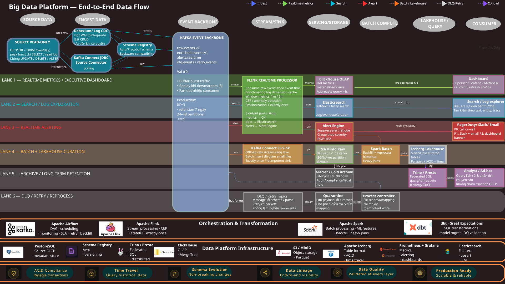
</p>

## Vấn đề dự án giải quyết

Phần khó của dự án không nằm ở các đường ống dữ liệu (phần đó chạy được từ sớm) mà ở chỗ "sự thật
về một bảng" (cột gì, khóa gì, vào topic nào) bị chép tay ở khoảng 10 nơi. Đổi một cột là phải sửa
nhiều file và rất dễ sót. Tôi gọi tình trạng này là metadata sprawl, và cả lộ trình 8 pha của dự án
là để xử lý nó:

| Trước | Sau |
|---|---|
| Schema rải rác ~10 nơi | 1 registry `metadata/` (dataset + connection + pipeline + quality) |
| Thêm cột: sửa tối đa 6 file Flink + 3 ClickHouse + Spark + ES | Thêm cột: sửa 1 contract rồi sinh lại |
| Connector/DDL/topic viết tay, dễ lệch | 19 artifact sinh từ contract, `cli check` so khớp từng byte |
| Không có gate khi thay đổi | CI: drift gate + compat BACKWARD + plan hệ quả artifact |
| Không lineage/catalog | Lineage cấp cột (Flink + Spark) + OpenMetadata, sinh từ metadata |
| Deploy thủ công qua REST/`curl` | Deployer idempotent (plan/apply) + rollback từ git ref |

Quá trình làm được ghi lại trong 38 ADR ([`docs/decisions/`](docs/decisions/README.md)) và
[roadmap 8 pha](docs/roadmap/BDP-metadata-driven-roadmap.md), đã hoàn tất và kiểm chứng trên
hệ thống chạy thật.

## Control plane

`metadata/` là đầu vào duy nhất. Generator sinh artifact, `cli check` so bản sinh với file trên đĩa
(khớp từng byte mới cho qua), deployer áp lên runtime, verifier đối chiếu ngược với hệ thống thật:

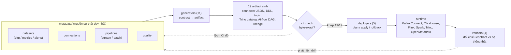

Mọi thay đổi đi qua cùng một vòng lặp 6 bước (kiểu strangler fig, thay dần bản viết tay):

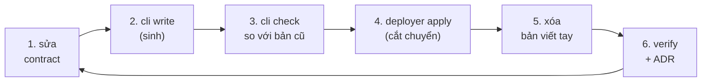

Bước 3 là chốt an toàn: chứng minh bản sinh giống hệt bản cũ trước khi dám thay. Trình tự chi tiết
từng pha nằm ở [`METADATA-DRIVEN-cac-buoc-trien-khai.md`](METADATA-DRIVEN-cac-buoc-trien-khai.md).

Ba lớp trong `dataplatform/`:

| Lớp | Số | Vai trò | Ví dụ |
|---|---|---|---|
| generators | 11 | contract → artifact | debezium, clickhouse_ddl, es_sink, s3_sink, flink_sql, topic_manifest, trino_catalog, lineage, airflow_dag, postgres_publication, dlq |
| deployers | 5 | áp desired state (idempotent, plan/apply, rollback) | connectors, clickhouse_migrate, spark_batch, flink_metrics, openmetadata |
| verifiers | 4 | đối chiếu contract với hệ thống thật | postgres_schema, clickhouse_schema, avro_schema, quality |

## Luồng dữ liệu

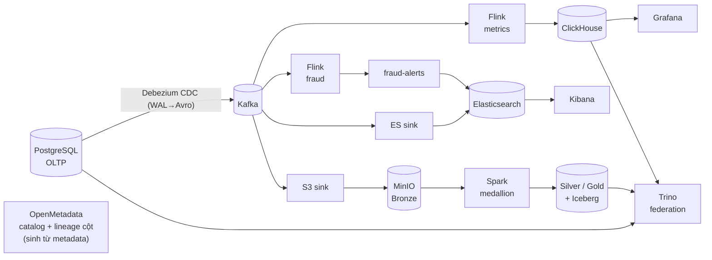

<table>
<tr>
<td width="50%"><b>CDC nguồn (Debezium)</b><br/>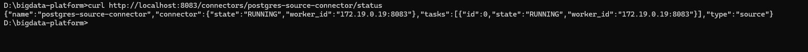</td>
<td width="50%"><b>Kafka topics (CDC, metrics, fraud)</b><br/>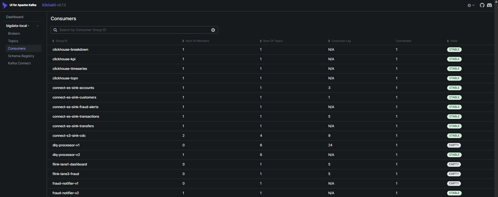</td>
</tr>
<tr>
<td><b>Flink jobs (streaming)</b><br/>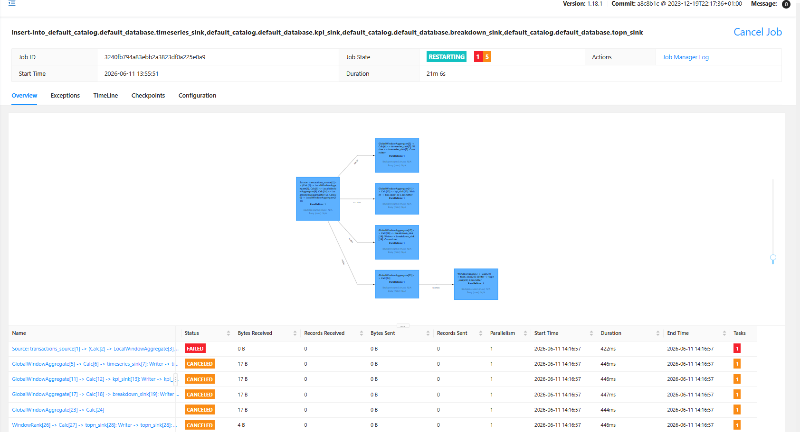</td>
<td><b>Grafana realtime dashboard</b><br/>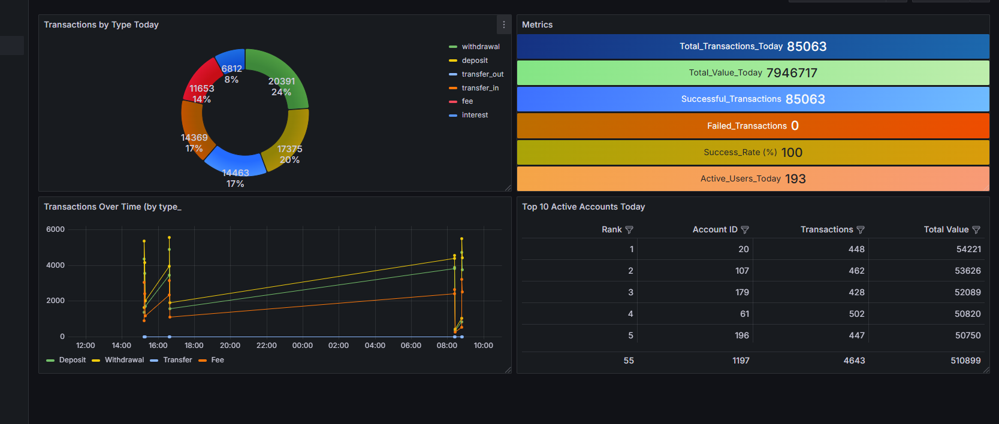</td>
</tr>
<tr>
<td><b>MinIO lakehouse (Bronze/Silver/Gold/Iceberg)</b><br/>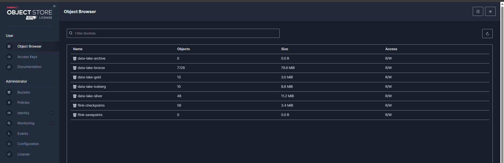</td>
<td><b>Kibana: điều tra fraud/failed</b><br/>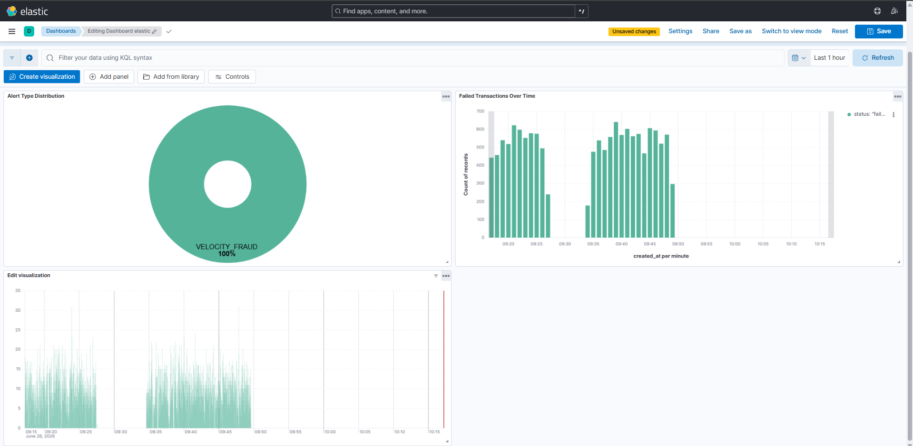</td>
</tr>
</table>

## Các pha đã làm (1–8, hoàn tất)

| Pha | Nội dung | Kiểm chứng trên runtime |
|---|---|---|
| 1–2 | Contract registry + sinh ingestion (Debezium, publication, topic, ClickHouse DDL) + deployer idempotent + CI drift gate | `check` 19/19, `avro_schema` 0 lệch, auto-create.topics tắt |
| 3 | Flink runner khai báo (metric + fraud) sinh từ pipeline spec | job chạy, DDL khớp ClickHouse |
| 4 | ClickHouse serving sinh từ contract | `clickhouse_schema` 0 drift |
| 5 | Spark medallion (Silver/Gold/Iceberg) SQL-in-spec, chạy theo phụ thuộc | Iceberg 1.072 rows |
| 6 | Trino federation + lineage cấp cột (sqlglot) + OpenMetadata catalog | query 3 nguồn, OM 24 table, 25 cạnh |
| 7 | CI plan/compat gate, Airflow DAG sinh từ deps, migration versioned, data quality gate, rollback, RBAC | quality 66 check, DAG load OK, migration idempotent |
| 8 | Chốt cutover + runbook, một nơi để sửa là `metadata/` | không còn file viết tay song song |

Ngoài phạm vi (trục riêng, chưa làm): bảo mật (secret manager + auth service), HA/robustness,
Silver incremental.

## Cấu trúc thư mục

```text
bigdata-platform/
├── metadata/                    # nguồn sự thật duy nhất (contract YAML)
│   ├── datasets/                #   oltp / metrics / alerts
│   ├── connections/             #   postgres, clickhouse, iceberg, kafka, es, s3, schema-registry
│   ├── pipelines/               #   stream (Flink) / batch (Spark)
│   └── quality/                 #   luật data quality
├── dataplatform/                # control plane (Python)
│   ├── registry.py  cli.py  compat.py
│   ├── schemas/                 #   JSON Schema validate contract
│   ├── generators/  deployers/  verifiers/  exporters/
├── migrations/                  # versioned migration (clickhouse/ + iceberg native)
├── lineage/                     # graph.json + LINEAGE.md (sinh)
├── airflow/  openmetadata/  superset/   # chạy phiên riêng (compose riêng)
├── debezium/ kafka-connect/ kafka/ clickhouse/ trino/ postgres/   # artifact sinh, đừng sửa tay
├── flink/ spark/ dlq-processor/ fraud-notifier/ generator/        # runtime services + runner generic
├── docs/                        # decisions/ (38 ADR), roadmap/, architecture/, guide/ (runbook)
├── .github/                     # CI (metadata-check) + CODEOWNERS
└── docker-compose.yml
```

Các thư mục `debezium/`, `kafka-connect/`, `clickhouse/init/`, `kafka/`, `trino/etc/catalog/` là
artifact sinh. Sửa tay là CI `check` đỏ; muốn đổi thì sửa contract rồi `cli write`.

## Tech stack

| Layer | Công nghệ | Vai trò |
|---|---|---|
| Control plane | Python 3.12, PyYAML, jsonschema, sqlglot | sinh / gác / áp / đối chiếu từ metadata |
| Source DB | PostgreSQL 16 | OLTP nguồn, logical replication |
| CDC | Debezium | WAL → Avro CDC event |
| Backbone | Kafka (KRaft) + Schema Registry | truyền sự kiện + Avro schema |
| Streaming | Apache Flink 1.18 (PyFlink) | realtime metrics + fraud detection |
| Serving OLAP | ClickHouse (Kafka Engine + MV) + Grafana | metrics tốc độ cao + dashboard |
| Search | Elasticsearch + Kibana | tra cứu / điều tra CDC + fraud alert |
| Lakehouse | MinIO (S3) + Spark 3.5 + Apache Iceberg (REST catalog) | Bronze/Silver/Gold + snapshot/time-travel |
| Federation | Trino | query chéo Postgres × ClickHouse × Iceberg |
| Catalog/Lineage | OpenMetadata | discovery + lineage cấp cột + PII tag + data quality 4 lớp |
| BI | Apache Superset | dashboard nghiệp vụ (OLTP) + governance (OM → ClickHouse) |
| Orchestration | Apache Airflow (DAG sinh từ deps) | lịch batch medallion |
| Runtime | Docker Compose | chạy toàn bộ local/dev |

## Quick start

1\) Control plane (không cần Docker, thuần tĩnh):

```bash
pip install -r requirements-dev.txt
python -m dataplatform.cli check      # 19/19: artifact khớp metadata
python -m dataplatform.cli write      # sinh lại toàn bộ artifact từ metadata/
python -m dataplatform.cli plan       # (trên PR) hệ quả artifact khi merge
python -m dataplatform.cli compat     # (trên PR) gate BACKWARD
```

2\) Runtime platform:

```bash
cp .env.example .env                  # điền secret (không commit)
docker compose up -d                  # dựng toàn bộ stack
docker compose up -d kafka-init       # tạo topic (auto.create.topics=false)
```

<p align="center">
  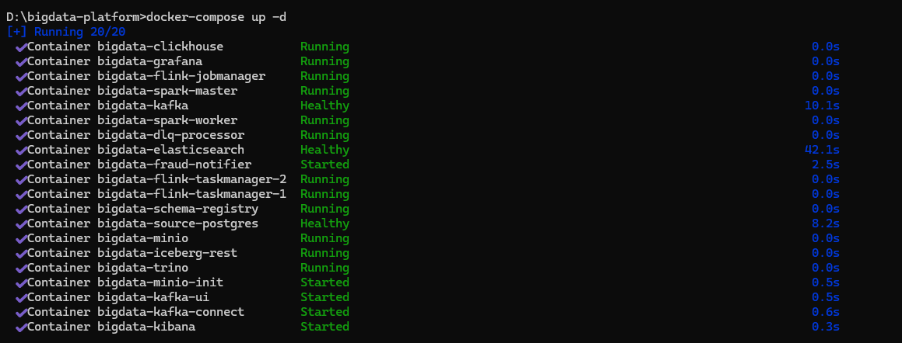
</p>

3\) Áp cấu hình từ metadata (thay cho đăng ký connector thủ công):

```bash
python -m dataplatform.deployers.connectors        apply   # Debezium + ES/S3 sink
python -m dataplatform.deployers.clickhouse_migrate apply   # schema + migration
python -m dataplatform.deployers.flink_metrics     apply   # Flink runner
python -m dataplatform.deployers.spark_batch       apply   # medallion Silver→Gold→Iceberg
```

4\) Đối chiếu với hệ thống thật:

```bash
python -m dataplatform.verifiers.avro_schema        # Avro trên dây vs contract
python -m dataplatform.verifiers.clickhouse_schema  # bảng CH vs contract
python -m dataplatform.verifiers.quality            # data quality gate
```

Catalog UI (OpenMetadata) và Airflow chạy phiên riêng (compose riêng, tốn RAM), xem
[`docs/guide/runbook.md`](docs/guide/runbook.md).

Service URLs: Kafka UI `:8080`, Connect `:8083`, Schema Registry `:8081`, Flink `:8082`,
ClickHouse `:8123`, Grafana `:3000`, MinIO `:9001`, Kibana `:5601`, Trino `:8085`,
OpenMetadata `:8585`, Airflow `:8090`, Superset `:8088`

## Governance & BI (OpenMetadata + Superset)

Sau cutover, catalog không chỉ để tra cứu mà thành nguồn dữ liệu phân tích được:

- **Governance sinh từ metadata** ([ADR-0038](docs/decisions/0038-om-governance-from-metadata.md)):
  domain/tier/owner khai trong contract, đẩy vào OpenMetadata cùng classification, 14 metric entity,
  và data quality đủ 4 lớp của OM (TestDefinition → TestCase → TestSuite basic/logical → TestCaseResult).
  66 test case dùng đúng một nguồn luật với quality gate — `verifiers/quality --push-om` chạy trên dữ
  liệu thật rồi đẩy kết quả lên OM thành time-series. Lineage nối trọn chuỗi tới điểm cuối:
  `transactions → Flink metric → ClickHouse → Grafana dashboard`.
- **BI trên hai tuyến** (Superset, compose phiên riêng trong `superset/`):

```text
Postgres OLTP ─────────────────────────▶ Superset "Banking Transaction Analytics"
OpenMetadata API ──exporter──▶ ClickHouse governance.* ──▶ Superset "Governance"
```

  Tuyến governance phải đi qua ClickHouse vì OM chỉ expose REST API (DB nội bộ của nó là JSON blob,
  không phải hợp đồng tích hợp); exporter (`dataplatform/exporters/om_governance.py`) dọn blob một lần
  thành bảng phẳng, dashboard sống độc lập kể cả khi OM tắt. Dashboard dựng bằng API, idempotent
  (`superset/build_dashboard.py` + `build_banking_dashboard.py`).

<p align="center">
  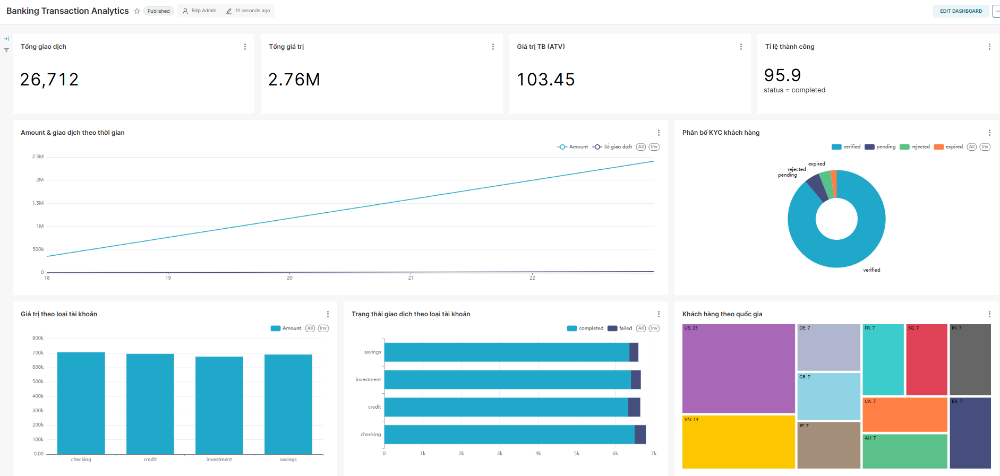
</p>

---

## Reliability & Observability

Mọi sink bật dead-letter queue. DLQ processor phân loại lỗi transient/permanent/unknown thành dữ
liệu truy vấn được. Theo dõi qua Kafka UI, Flink UI, Spark UI, Grafana, Kibana, MinIO Console.

<table>
<tr>
<td width="50%"><b>DLQ processor: phân loại lỗi</b><br/>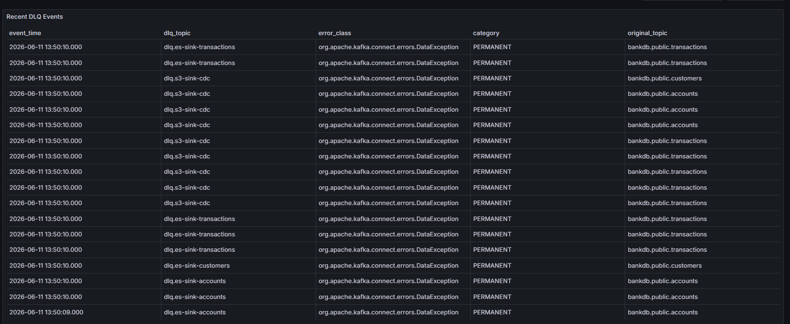</td>
<td width="50%"><b>Fault handling / observability</b><br/>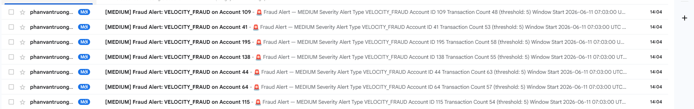</td>
</tr>
</table>

## Cách làm việc trong repo này

- ADR-first: quyết định đáng kể nào cũng có một ADR (bối cảnh, quyết định, hệ quả, phương án đã
  cân nhắc). Hiện có [38 ADR](docs/decisions/README.md).
- Generator phải sinh ra đúng từng byte bản viết tay cũ trước khi được phép thay nó.
- CI (`.github/workflows/metadata-check.yml`): drift (`check`) + BACKWARD (`compat`) + plan hệ quả,
  chạy thuần tĩnh.
- Verify runtime: đối chiếu contract với schema thật ở Postgres/ClickHouse/Avro trên dây.
- RBAC/audit: `.github/CODEOWNERS` theo vùng metadata + `owner` trong contract + audit qua Git/lineage.

## Tài liệu

| Muốn hiểu | Đọc |
|---|---|
| Trình tự triển khai (làm từ đâu tới đâu) | [`METADATA-DRIVEN-cac-buoc-trien-khai.md`](METADATA-DRIVEN-cac-buoc-trien-khai.md) |
| Cái đích + từng pha | [`docs/roadmap/BDP-metadata-driven-roadmap.md`](docs/roadmap/BDP-metadata-driven-roadmap.md) |
| Điểm xuất phát (metadata sprawl) | [`docs/architecture/BDP-current-state.md`](docs/architecture/BDP-current-state.md) |
| Vận hành hằng ngày + gotchas | [`docs/guide/runbook.md`](docs/guide/runbook.md) |
| Vì sao mỗi quyết định | [`docs/decisions/README.md`](docs/decisions/README.md) (index 38 ADR) |

## Tác giả

Phan Văn Trường — Data Engineering (fintech CDC, streaming, lakehouse)
