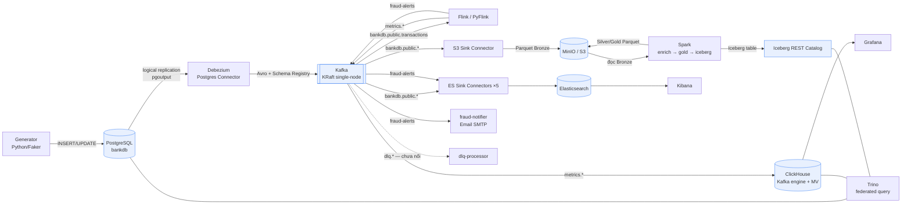

# Kiến trúc Bigdata Platform — CDC → streaming/batch → lakehouse

> Nền tảng dữ liệu ngân hàng gần thời gian thực chạy hoàn toàn bằng Docker Compose.
> **Mỗi công cụ một nhiệm vụ:** Debezium **bắt** thay đổi, Kafka **truyền**, Flink **tính realtime**,
> Kafka Connect **đổ** ra kho, Spark **xử lý batch**, ClickHouse/ES **phục vụ**, Trino **liên kết**.
> Cập nhật lần cuối: 2026-07-15.

---

## 1. Ý tưởng trong một câu

> PostgreSQL ghi giao dịch → Debezium đọc WAL và phát CDC event vào Kafka → từ Kafka, dữ liệu **tách
> làm 3 nhánh song song**: Flink tính metric/fraud realtime, Kafka Connect đẩy sang Elasticsearch để
> tra cứu, và Kafka Connect ghi Parquet vào MinIO làm Bronze cho Spark xử lý batch.

Điểm mấu chốt: **Kafka là điểm chia nhánh duy nhất**. Mọi tầng hạ nguồn đều đọc từ Kafka, không đọc
trực tiếp từ PostgreSQL. Nguồn OLTP chỉ chịu tải của chính nó cộng một replication slot.

---

## 2. Luồng dữ liệu

> Mũi tên `dlq.*` vẽ nét đứt vì **chưa có connector nào cấu hình dead-letter queue** — xem
> [ADR-0012](../decisions/0012-dlq-processor-not-wired.md) và [`../guide/dlq-and-notifier.md`](../guide/dlq-and-notifier.md).

---

## 3. Bốn lane xử lý

Tên "lane" bám theo cách đặt tên trong code (`flink/jobs/lane1_*.py`, `lane3_*.py`).

| Lane | Code | Nguồn | Đích | Làm gì |
|---|---|---|---|---|
| **Lane 1 — Dashboard metrics** | [`flink/jobs/lane1_dashboard.py`](../../flink/jobs/lane1_dashboard.py) | `bankdb.public.transactions` | `metrics.{timeseries,kpi,breakdown,topn}` → ClickHouse | 4 nhóm metric bằng TUMBLE 1 phút + CUMULATE 5 phút/ngày, gộp trong **một** `StatementSet`. |
| **Lane 2 — Search/serving** | 5 file [`kafka-connect/es-sinks/*.json`](../../kafka-connect/es-sinks/) | `bankdb.public.*` + `fraud-alerts` | Elasticsearch → Kibana | Upsert theo PK, không transform ngoài `unwrap`. |
| **Lane 3 — Fraud detection** | [`flink/jobs/lane3_fraud_detection.py`](../../flink/jobs/lane3_fraud_detection.py) | `bankdb.public.transactions` | `fraud-alerts` → ES + email | 2 detector viết bằng DataStream API: Velocity + Failed Storm. |
| **Lane 4 — Lakehouse batch** | [`kafka-connect/s3-sinks/s3-sink-cdc.json`](../../kafka-connect/s3-sinks/s3-sink-cdc.json) + [`spark/jobs/*.py`](../../spark/jobs/) | `bankdb.public.*` | MinIO Bronze → Silver → Gold → Iceberg | S3 sink ghi Parquet; Spark dedup + join + tổng hợp. |

Lane 1 và Lane 3 đọc **cùng** topic `bankdb.public.transactions` nhưng bằng hai `group.id` khác nhau
(`flink-lane1-dashboard`, `flink-lane3-fraud`), nên chúng tiêu thụ độc lập, không tranh offset.

Một khác biệt dễ bỏ sót: Lane 1 dùng `scan.startup.mode = 'earliest-offset'` (tính lại từ đầu topic),
còn Lane 3 dùng `'latest-offset'` (chỉ cảnh báo trên dữ liệu mới). Vì vậy khởi động lại job fraud sẽ
**không** phát lại alert của quá khứ, còn khởi động lại Lane 1 thì có tính lại metric cũ.

---

## 4. Ranh giới trách nhiệm giữa các công cụ

Đây là phần cần giữ ổn định — mỗi khi thêm tính năng, hãy đặt nó vào đúng ô.

| Công cụ | **Chịu trách nhiệm** | **Không làm** |
|---|---|---|
| PostgreSQL | Lưu trạng thái OLTP, bật `wal_level=logical`, khai báo publication. | Không phân tích, không tổng hợp. |
| Debezium | Đọc WAL → Kafka. Chuẩn hoá thành envelope `{op, ts_ms, before, after}`. | Không lọc nghiệp vụ, không enrich. |
| Kafka | Điểm chia nhánh + buffer + replay. | Không lưu trữ dài hạn (đó là việc của lake). |
| Schema Registry | Giữ Avro schema, cấp ID cho message. | Không kiểm soát tương thích (chưa bật gate). |
| Flink | Tính **realtime** có state: window, watermark, CEP. | Không ghi thẳng ClickHouse — ghi qua Kafka. |
| Kafka Connect | **Đổ** dữ liệu ra ES/S3, không biến đổi ngoài `unwrap`/`extractKey`. | Không tổng hợp, không join. |
| ClickHouse | Serving OLAP cho dashboard, tự consume Kafka bằng engine + MV. | Không là nguồn sự thật — có TTL 30/90 ngày. |
| Spark | Batch: dedup về current state, join, tổng hợp Gold, ghi Iceberg. | Không xử lý realtime. |
| Trino | Truy vấn liên nguồn ad-hoc. | Không ETL, không ghi. |

**Lời hứa quan trọng:** Flink **không bao giờ** ghi trực tiếp vào ClickHouse. Nó ghi ra Kafka topic
`metrics.*`, rồi ClickHouse tự kéo về bằng Kafka engine. Nhờ vậy metric có thể replay, và ClickHouse
sập không làm Flink backpressure.

---

## 5. Kiểm kê thành phần

21 service trong [`docker-compose.yml`](../../docker-compose.yml). Bảng port đầy đủ ở
[`../infra/infra.md`](../infra/infra.md).

| Lớp | Service | Container | Image | Vai trò |
|---|---|---|---|---|
| Nguồn | postgres | `bigdata-source-postgres` | postgres:16-alpine | OLTP, `wal_level=logical`, 4 bảng. |
| Nguồn | generator | `bigdata-generator` | build | Sinh tải (profile `generator`, không tự chạy). |
| CDC | kafka-connect | `bigdata-kafka-connect` | build | Chạy Debezium source + 6 sink connector. |
| Backbone | kafka | `bigdata-kafka` | cp-kafka:7.7.1 | Event bus (KRaft, node vừa broker vừa controller). |
| Backbone | schema-registry | `bigdata-schema-registry` | cp-schema-registry:7.7.1 | Avro schema. |
| Backbone | kafka-ui | `bigdata-kafka-ui` | provectuslabs/kafka-ui | Quan sát topic/message/connector. |
| Stream | jobmanager | `bigdata-flink-jobmanager` | build pyflink:1.18.1 | Điều phối Flink job. |
| Stream | taskmanager-1/2 | `bigdata-flink-taskmanager-{1,2}` | bigdata-pyflink:1.18.1 | Thực thi, 2 slot mỗi TM → 4 slot tổng. |
| Serving | clickhouse | `bigdata-clickhouse` | clickhouse-server:24.8 | OLAP metrics. |
| Serving | grafana | `bigdata-grafana` | grafana:11.4.0 | Dashboard realtime từ ClickHouse. |
| Lake | minio | `bigdata-minio` | minio | Object store S3-compatible. |
| Lake | minio-init | `bigdata-minio-init` | minio/mc | Tạo bucket checkpoint lúc khởi động (chỉ 2 bucket — xem §6). |
| Lake | iceberg-rest | `bigdata-iceberg-rest` | tabulario/iceberg-rest:1.6.0 | REST catalog cho Iceberg. |
| Batch | spark-master | `bigdata-spark-master` | apache/spark:3.5.0 | Điều phối batch. |
| Batch | spark-worker | `bigdata-spark-worker` | apache/spark:3.5.0 | 2 core / 2 GB. |
| Search | elasticsearch | `bigdata-elasticsearch` | elasticsearch:8.15.3 | Index tra cứu (single-node, tắt security). |
| Search | kibana | `bigdata-kibana` | kibana:8.15.3 | Trực quan/điều tra. |
| Query | trino | `bigdata-trino` | trinodb/trino:432 | Federation 3 catalog. |
| Ops | fraud-notifier | `bigdata-fraud-notifier` | build | Consumer `fraud-alerts` → email SMTP. |
| Ops | dlq-processor | `bigdata-dlq-processor` | build | Consumer DLQ → ClickHouse (**chưa nối**). |

---

## 6. Những chỗ kiến trúc *chưa* khép kín

Ghi ở đây để không ai phải phát hiện lại bằng cách debug. Chi tiết + cách xử lý ở
[`BDP-current-state.md`](BDP-current-state.md).

1. **ClickHouse init không tự chạy.** `clickhouse/init/` **không** được mount vào
   `/docker-entrypoint-initdb.d`, nên bảng `metrics.*` phải tạo tay sau khi stack lên. Xem
   [`../guide/clickhouse-grafana.md`](../guide/clickhouse-grafana.md) §1.
2. **`minio-init` chỉ tạo `flink-checkpoints` và `flink-savepoints`.** Các bucket
   `data-lake-{bronze,silver,gold,iceberg}` **không** được tạo tự động — phải tạo trước khi chạy S3
   sink và Spark job.
3. **Không connector nào bật DLQ**, nên 6 topic `dlq.*` mà `dlq-processor` subscribe không bao giờ có
   message. Bảng `metrics.dlq_events` mà nó INSERT vào cũng **không** tồn tại trong init schema.
4. **4 file `lane1_{timeseries,kpi,breakdown,topn}.py` là di sản** — logic của chúng đã được gộp vào
   `lane1_dashboard.py`. Chạy song song sẽ ghi trùng vào cùng topic metric.
   Xem [ADR-0006](../decisions/0006-one-flink-job-per-lane-statement-set.md).
5. **Mọi thứ đều single-node** (Kafka RF=1, ES single-node, 1 Spark worker). Đúng cho lab, không đủ
   cho production.
