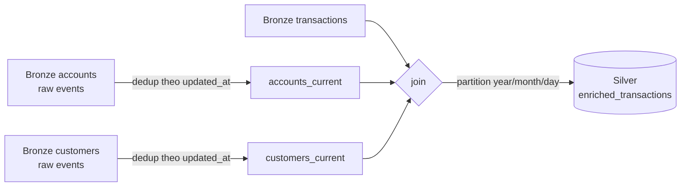

# Lakehouse — Bronze → Silver → Gold → Iceberg

> Nhánh batch: Kafka Connect ghi raw CDC thành Parquet trên MinIO, Spark dedup + join + tổng hợp,
> Iceberg cấp table format có snapshot/time-travel. Nguồn: [`spark/jobs/`](../../spark/jobs/) và
> [`kafka-connect/s3-sinks/`](../../kafka-connect/s3-sinks/).
> Cách chạy: [`../guide/spark-lakehouse.md`](../guide/spark-lakehouse.md).
> Cập nhật lần cuối: 2026-07-15.

---

## 1. Vì sao có nhánh batch khi đã có streaming

Flink trả lời câu "**đang** xảy ra chuyện gì" — trong 1 phút vừa rồi. Nhánh batch trả lời câu
"**đã** xảy ra chuyện gì" — trên toàn bộ lịch sử, có join, có tổng hợp lớn, có thể chạy lại.

| | Streaming (Flink → ClickHouse) | Batch (S3 sink → Spark → lake) |
|---|---|---|
| Độ trễ | giây | phút–giờ |
| Phạm vi | cửa sổ thời gian | toàn bộ lịch sử |
| Join | không (chỉ tổng hợp `transactions`) | có (transaction × account × customer) |
| Lưu trữ | TTL 30/90 ngày | vĩnh viễn |
| Chạy lại | phải replay từ Kafka | đọc lại Parquet bất cứ lúc nào |

---

## 2. Bronze — S3 sink

[`kafka-connect/s3-sinks/s3-sink-cdc.json`](../../kafka-connect/s3-sinks/s3-sink-cdc.json) — **một**
connector, 2 task, đổ cả 4 topic CDC.

```text
s3a://data-lake-bronze/topics/bankdb.public.transactions/year=2026/month=07/day=15/hour=09/*.parquet
```

| Cấu hình | Giá trị | Ý nghĩa |
|---|---|---|
| `format.class` | `ParquetFormat` + snappy | Cột, nén, Spark đọc thẳng. |
| `partitioner.class` | `TimeBasedPartitioner`, `partition.duration.ms=3600000` | Thư mục theo **giờ**. |
| `path.format` | `'year'=YYYY/'month'=MM/'day'=dd/'hour'=HH` | Hive-style, Spark tự nhận partition. |
| `timestamp.extractor` | `Record` | Dùng timestamp **trong message**, không phải lúc ghi (`Wallclock`) → replay cho ra cùng layout. |
| `flush.size` | `1000` | Ghi file sau mỗi 1000 record… |
| `rotate.interval.ms` | `300000` | …hoặc sau 5 phút, tuỳ cái nào tới trước. |
| `transforms.unwrap` | `ExtractNewRecordState`, `delete.handling.mode=rewrite` | **Chỉ giữ phần `after`**, bỏ envelope. DELETE thành row có cờ `__deleted`. |
| `schema.compatibility` | `NONE` | Không kiểm tra tiến hoá schema — schema đổi thì file cũ/mới lệch nhau, Spark tự xoay xở. |

**Hệ quả của `unwrap`:** file Bronze **không có** `op` và `ts_ms`. Nó trông như bảng nguồn, không như
CDC log. Vì vậy Spark không phân biệt được INSERT với UPDATE — nó dedup bằng `updated_at`, xem §3.

> Bucket `data-lake-bronze` **không** được tạo tự động. `minio-init` chỉ tạo `flink-checkpoints` và
> `flink-savepoints`. Chưa tạo bucket thì connector fail ngay.

---

## 3. Silver — `medallion_runner` + `silver_enriched_transactions.yaml`

Bronze → một bảng transaction đã enrich. Nay chạy bằng runner chung
[`spark/jobs/medallion_runner.py`](../../spark/jobs/medallion_runner.py) đọc SQL từ
[`metadata/pipelines/batch/silver_enriched_transactions.yaml`](../../metadata/pipelines/batch/silver_enriched_transactions.yaml)
(mô hình dbt, [ADR-0024](../decisions/0024-spark-medallion-runner-sql.md)) — thay `enrich_transactions.py` đã xoá.



**Bước 1 — dedup về current state.** Bronze chứa **mọi phiên bản** của một account (mỗi lần balance
đổi là một row). Join thẳng sẽ nhân bản giao dịch lên nhiều lần. Nên phải gấp về trạng thái mới nhất:

```python
accounts_current = (accounts
    .withColumn("rn", row_number().over(
        Window.partitionBy("account_id").orderBy(col("updated_at").desc())))
    .filter(col("rn") == 1).drop("rn"))
```

`customers` cũng vậy, theo `customer_id` + `updated_at`. `transactions` **không** cần dedup vì nó
append-only.

**Bước 2 — join.** `transactions × accounts_current` theo `account_id`, rồi `× customers_current` theo
`customer_id`. Đều là inner join → giao dịch có account không tìm thấy trong Bronze sẽ **bị loại âm
thầm**, không có bảng lỗi nào ghi lại.

**Bước 3 — ghi.** Partition `year/month/day` suy từ `posted_at`, mode `overwrite`:

```text
s3a://data-lake-silver/enriched_transactions/year=2026/month=7/day=15/
```

Cột đầu ra: `transaction_id`, `transaction_type`, `amount`, `currency`, `status`, `posted_at`,
`account_id`, `account_type`, `account_number`, `customer_id`, `customer_name`, `country_code`,
`kyc_status`, `risk_score`, + `year`/`month`/`day`.

> **`mode("overwrite")` ghi đè *toàn bộ* Silver mỗi lần chạy** — đây là full refresh, không phải
> incremental. Đúng cho lab, nhưng không mở rộng được: mỗi lần chạy là đọc lại toàn bộ Bronze.
> Ngoài ra `posted_at` có thể NULL (giao dịch `pending` chưa post) → những row đó rơi vào partition
> `year=__HIVE_DEFAULT_PARTITION__`.

---

## 4. Gold — `build_gold_layer.py`

[`spark/jobs/build_gold_layer.py`](../../spark/jobs/build_gold_layer.py): Silver → 3 bảng phân tích.
Vì `amount` vẫn là STRING (di sản từ `decimal.handling.mode=string`), job cast trước:
`silver.withColumn("amount_dbl", col("amount").cast("double"))`.

| Bảng Gold | Group by | Đo lường |
|---|---|---|
| `daily_transaction_summary` | `year, month, day, country_code, transaction_type` | `txn_count`, `total_volume`, `avg_amount`, `unique_customers`, `failed_count` |
| `customer_lifetime_metrics` | `customer_id` | tổng hợp vòng đời khách hàng |
| `high_risk_transactions` | — (lọc) | giao dịch của khách hàng rủi ro cao |

Đường dẫn: `s3a://data-lake-gold/<tên bảng>/`.

---

## 5. Iceberg — `silver_to_iceberg.py`

[`spark/jobs/silver_to_iceberg.py`](../../spark/jobs/silver_to_iceberg.py) — cùng dữ liệu Silver nhưng
dưới dạng **table format**, để có snapshot và time travel.

| Cấu hình | Giá trị |
|---|---|
| Catalog | `lakehouse`, type `rest` → `http://iceberg-rest:8181` ([ADR-0009](../decisions/0009-iceberg-rest-catalog.md)) |
| Warehouse | `s3a://data-lake-iceberg/warehouse` |
| `io-impl` | `HadoopFileIO` (**không** `S3FileIO`) |
| Bảng | `lakehouse.silver.enriched_transactions` |

**Vì sao `HadoopFileIO` chứ không `S3FileIO`?** Comment trong code nói rõ: S3A đã được kiểm chứng với
MinIO, còn `S3FileIO` (AWS SDK v2) gặp treo ở multipart upload. Lưu ý config này bị đặt **hai lần**
trong file — vô hại, nhưng thừa.

**Job làm gì:**
1. `CREATE NAMESPACE IF NOT EXISTS lakehouse.silver`
2. `DROP TABLE IF EXISTS ... PURGE` — **xoá sạch mỗi lần chạy**
3. `CREATE TABLE ... USING iceberg AS SELECT * FROM silver_source` → snapshot #1
4. Append thêm 1000 row (giả lập batch hôm sau) → snapshot #2
5. Đọc `.history` / `.snapshots` và demo time travel giữa 2 snapshot

**Không partition** — comment giải thích là để tránh vấn đề bộ nhớ của FanoutWriter. Có thể thêm sau
bằng `ALTER TABLE`.

> Đây là **job trình diễn**, không phải pipeline production: nó `DROP TABLE ... PURGE` rồi tạo lại từ
> đầu, nên mọi lịch sử snapshot cũ mất sạch mỗi lần chạy. Bước "append 1000 row" cũng chỉ là dữ liệu
> Silver đọc lại, tức **nhân đôi** 1000 giao dịch — cốt để có snapshot thứ hai mà demo time travel.

---

## 6. Thứ tự phụ thuộc

Không có orchestrator — không Airflow, không cron. Ba job phải **chạy tay theo đúng thứ tự**:

```text
S3 sink connector (liên tục)
        ↓  cần đủ dữ liệu Bronze
enrich_transactions.py       →  Silver
        ↓                        ↓
build_gold_layer.py          silver_to_iceberg.py
   (cần Silver)                 (cần Silver)
```

Chạy `build_gold_layer.py` khi chưa có Silver sẽ fail ở bước đọc Parquet. Đây chính là phần
[Pha 7 của lộ trình](../roadmap/BDP-metadata-driven-roadmap.md) đề xuất sinh DAG từ phụ thuộc dataset.
