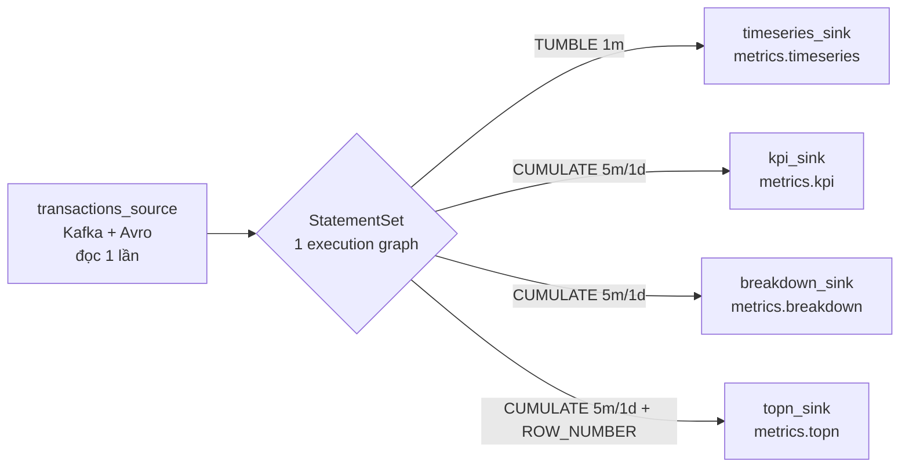
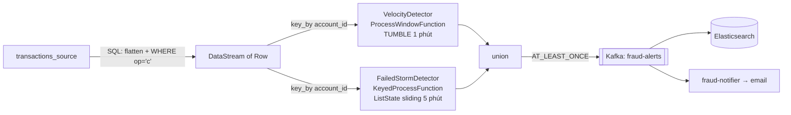

# Tầng streaming — Lane 1 (metrics) và Lane 3 (fraud)

> Hai job PyFlink đọc cùng một topic CDC nhưng khác nhau về mọi thứ còn lại: Lane 1 là **Table API
> khai báo** (SQL, window, aggregate), Lane 3 là **DataStream API mệnh lệnh** (state, timer, CEP).
> Nguồn: [`flink/jobs/`](../../flink/jobs/). Cách chạy: [`../guide/flink-jobs.md`](../guide/flink-jobs.md).
> Cập nhật lần cuối: 2026-07-15.

---

## 1. Cấu hình chung của cả hai job

| Thiết lập | Giá trị | Ý nghĩa |
|---|---|---|
| Parallelism | `1` | Đủ cho lab; cả cluster có 4 slot (2 TM × 2 slot). |
| Checkpoint | 30 giây, `EXACTLY_ONCE` | State lưu ở `s3a://flink-checkpoints/checkpoints` (MinIO). |
| Watermark | `event_time - INTERVAL '5' SECOND` | Chấp nhận trễ 5 giây; event trễ hơn bị **bỏ**. |
| `event_time` | `TO_TIMESTAMP_LTZ(ts_ms, 3)` | Lấy từ `ts_ms` của Debezium — thời điểm **commit ở Postgres**, không phải lúc Flink nhận. |
| Idle timeout | `5000 ms` | Partition im lặng không chặn watermark tiến lên. |
| JAR | `flink-sql-connector-kafka-3.1.0-1.18.jar`, `flink-sql-avro-confluent-registry-1.18.1.jar` | Nạp runtime từ `/opt/flink/jobs/jars`. |

Cả hai đều khai báo **cùng một** source table với khối `ROW<...>` giống hệt nhau — copy-paste, không
chia sẻ. Đây là trọng tâm của [Pha 3 lộ trình metadata-driven](../roadmap/BDP-metadata-driven-roadmap.md).

```sql
CREATE TABLE transactions_source (
    op STRING,
    ts_ms BIGINT,
    `after` ROW<transaction_id BIGINT, account_id BIGINT, transaction_type STRING,
                amount STRING, currency STRING, status STRING>,
    event_time AS TO_TIMESTAMP_LTZ(ts_ms, 3),
    WATERMARK FOR event_time AS event_time - INTERVAL '5' SECOND
) WITH ('connector' = 'kafka', 'topic' = 'bankdb.public.transactions', ...)
```

Điểm khác nhau then chốt giữa hai job:

| | Lane 1 | Lane 3 |
|---|---|---|
| `group.id` | `flink-lane1-dashboard` | `flink-lane3-fraud` |
| `scan.startup.mode` | `earliest-offset` | `latest-offset` |
| Hệ quả khi restart | Tính lại metric từ đầu topic | Chỉ cảnh báo trên dữ liệu mới |

---

## 2. Lane 1 — Dashboard metrics

[`flink/jobs/metric_runner.py`](../../flink/jobs/metric_runner.py) — **một** job sinh ra **bốn**
luồng metric, gộp bằng `StatementSet` để chia sẻ chung một lần đọc Kafka
([ADR-0006](../decisions/0006-one-flink-job-per-lane-statement-set.md)). SQL của cả bốn nay **sinh** từ
[`metadata/pipelines/stream/`](../../metadata/pipelines/stream/) thay vì viết tay ([ADR-0023](../decisions/0023-flink-metric-runner-declarative.md)).



Cả 4 đều lọc `WHERE op = 'c'` (chỉ INSERT) và ghi ra Kafka dạng JSON với `sink.partitioner = 'fixed'`.

| Metric | Window | Group by | Tính gì |
|---|---|---|---|
| **timeseries** | `TUMBLE(1 MINUTE)` | `tx_type` | `COUNT(*)`, `SUM(CAST(after.amount AS DECIMAL(19,4)))` |
| **kpi** | `CUMULATE(5 MINUTE, 1 DAY)` | — (toàn cục) | tổng số, tổng giá trị, `COUNT(*) FILTER (status='completed')`, `FILTER (status='failed')`, tỉ lệ thành công, `COUNT(DISTINCT account_id)` |
| **breakdown** | `CUMULATE(5 MINUTE, 1 DAY)` | `tx_type` | như KPI nhưng chẻ theo loại |
| **topn** | `CUMULATE(5 MINUTE, 1 DAY)` | `account_id` | `ROW_NUMBER() OVER (ORDER BY total_value DESC)`, giữ `rn <= 10` |

**TUMBLE và CUMULATE khác nhau ở đâu, và vì sao lại chọn vậy:**

- `TUMBLE 1 phút` — cửa sổ rời nhau, mỗi giao dịch thuộc đúng một cửa sổ. Hợp với biểu đồ đường
  "một điểm mỗi phút".
- `CUMULATE 5 phút / 1 ngày` — cửa sổ **cộng dồn** từ nửa đêm, phát kết quả mỗi 5 phút và reset lúc
  0h. Hợp với thẻ KPI "hôm nay tới giờ": số liệu chỉ tăng dần trong ngày.

Vì `active_users` dùng `COUNT(DISTINCT account_id)` trên cửa sổ cộng dồn 1 ngày, state của job **lớn
dần suốt ngày** rồi rơi về 0 lúc nửa đêm. Đó là hành vi đúng như thiết kế, nhưng cần biết khi xem
biểu đồ dung lượng checkpoint.

---

## 3. Lane 3 — Fraud detection

[`flink/jobs/lane3_fraud_detection.py`](../../flink/jobs/lane3_fraud_detection.py) — dùng Table API để
đọc + flatten, rồi chuyển sang **DataStream API** vì logic phát hiện cần state tuỳ biến mà SQL không
diễn đạt gọn được.



### 3.1 Hai detector

| | **VELOCITY_FRAUD** | **FAILED_STORM** |
|---|---|---|
| Lớp | `VelocityDetector(ProcessWindowFunction)` | `FailedStormDetector(KeyedProcessFunction)` |
| Cửa sổ | Tumbling event-time 1 phút | **Sliding** 5 phút, tự quản bằng state |
| Ngưỡng | `count > 5` giao dịch/phút/account | `>= 15` giao dịch **failed** trong 5 phút |
| Severity | `MEDIUM` | `HIGH` |
| State | Do window quản lý | `ListState` chứa `(ts_ms, tx_id, amount)` |
| Dọn state | Window tự đóng | Timer event-time + lọc `cutoff` mỗi event |

**Vì sao Failed Storm không dùng window có sẵn?** Tumbling window reset cứng ở biên. 14 giao dịch lỗi
lúc 10:00:59 và 14 giao dịch nữa lúc 10:01:01 sẽ **không** kích hoạt cảnh báo dù 28 lỗi xảy ra trong
2 giây. `KeyedProcessFunction` + `ListState` cho phép cửa sổ **trượt theo từng event**: mỗi giao dịch
lỗi đến sẽ lọc bỏ mục cũ hơn 5 phút rồi đếm lại phần còn lại. Bù lại, code phải tự dọn state — làm
bằng `register_event_time_timer(current + window_ms)`, timer fire thì xoá lịch sử của account im lặng
để state không phình mãi.

### 3.2 Hình dạng alert

Alert là JSON chuỗi (`SimpleStringSchema`), không phải Avro:

```json
{"alert_type":"VELOCITY_FRAUD","severity":"MEDIUM","account_id":123,
 "tx_count":8,"threshold":5,"window_start_ms":1699999980000,"window_end_ms":1700000040000}
```

```json
{"alert_type":"FAILED_STORM","severity":"HIGH","account_id":123,
 "failure_count_window":17,"threshold":15,"window_minutes":5,"detected_at_ms":1700000040000,
 "recent_failures":[{"ts_ms":...,"tx_id":...,"amount":"..."}]}
```

Các trường thời gian là **epoch millis dạng số**, không phải chuỗi ISO. Vì thế Kibana thường không tự
nhận `window_start_ms`/`detected_at_ms` là kiểu date — xem [`../guide/kibana.md`](../guide/kibana.md) §2.

### 3.3 Đảm bảo giao hàng

Kafka sink dùng `DeliveryGuarantee.AT_LEAST_ONCE` — không phải `EXACTLY_ONCE` như checkpoint. Alert
**có thể bị lặp** khi job restart. Với cảnh báo thì lặp chấp nhận được (thà báo hai lần còn hơn bỏ
sót), nhưng consumer hạ nguồn không nên coi alert là idempotent.

### 3.4 Print sink còn sót

Job vẫn giữ hai `.print()` debug (`LANE3-RAW` in **mọi** transaction, `ALERT` in mọi alert). Chúng ghi
vào log TaskManager và ở tải 150 RPS sẽ làm log phình rất nhanh. Nên gỡ trước khi chạy dài.

---

## 4. Vì sao metric đi vòng qua Kafka thay vì ghi thẳng ClickHouse

Flink **không** ghi trực tiếp vào ClickHouse. Nó ghi ra topic `metrics.*`, rồi ClickHouse tự kéo về
bằng Kafka engine. Đánh đổi:

**Được:**
- ClickHouse sập hoặc chậm không gây backpressure ngược lên Flink.
- Metric replay được — xoá bảng ClickHouse rồi cho MV đọc lại topic.
- Consumer khác (Grafana Live, service cảnh báo...) cắm thêm vào topic mà không đụng Flink.

**Mất:**
- Thêm một chặng → độ trễ cao hơn ghi thẳng.
- Schema phải khớp thủ công ở hai đầu: sink DDL của Flink và bảng Kafka engine của ClickHouse. Lệch
  cột thì MV **bỏ dữ liệu, không báo lỗi**.

Cái "mất" thứ hai chính là lý do [Pha 3–4 của lộ trình](../roadmap/BDP-metadata-driven-roadmap.md) sinh
cả hai đầu từ **một** spec metric duy nhất.
