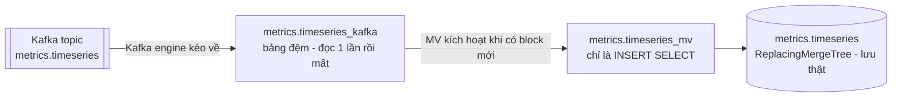

# ClickHouse & Grafana — tầng serving metric

> Khởi tạo schema (**không** tự chạy), kiểm tra Kafka engine + MV, dựng dashboard Grafana.
> Thiết kế: [ADR-0007](../decisions/0007-clickhouse-kafka-engine-serving.md),
> [`../architecture/BDP-data-model.md`](../architecture/BDP-data-model.md) §3.
> Cập nhật lần cuối: 2026-07-15.

---

## 1. ⚠️ Schema phải tạo tay

`clickhouse/init/` **không** được mount vào `/docker-entrypoint-initdb.d` trong
[`docker-compose.yml`](../../docker-compose.yml). ClickHouse khởi động **không có bảng nào**. Đây là
nguyên nhân số một của "Grafana trống trơn".

```bash
docker exec -i bigdata-clickhouse clickhouse-client --user admin --password "$CLICKHOUSE_PASSWORD" \
  --multiquery < clickhouse/init/01_schema.sql
docker exec -i bigdata-clickhouse clickhouse-client --user admin --password "$CLICKHOUSE_PASSWORD" \
  --multiquery < clickhouse/init/02_kafka_consumers.sql
```

PowerShell:
```powershell
Get-Content .\clickhouse\init\01_schema.sql | docker exec -i bigdata-clickhouse clickhouse-client --user admin --password $env:CLICKHOUSE_PASSWORD --multiquery
Get-Content .\clickhouse\init\02_kafka_consumers.sql | docker exec -i bigdata-clickhouse clickhouse-client --user admin --password $env:CLICKHOUSE_PASSWORD --multiquery
```

Kỳ vọng **12 bảng**:
```bash
docker exec bigdata-clickhouse clickhouse-client --user admin --password "$CLICKHOUSE_PASSWORD" \
  --query "SHOW TABLES FROM metrics"
```
```text
breakdown, breakdown_kafka, breakdown_mv,
kpi, kpi_kafka, kpi_mv,
timeseries, timeseries_kafka, timeseries_mv,
topn, topn_kafka, topn_mv
```

Phải chạy lại sau mỗi `docker compose down -v`.

---

## 2. Ba mảnh ghép của một metric

Mỗi metric cần **3 đối tượng**, hiểu rõ vai trò từng cái thì debug mới nhanh:



| Đối tượng | Bản chất | Lưu ý sống còn |
|---|---|---|
| `<m>_kafka` | Kafka engine, `JSONEachRow` | **Đọc một lần là mất.** `SELECT` thẳng vào nó sẽ *tiêu thụ* message và cướp dữ liệu của MV. Chỉ dùng để debug khi MV đang dừng. |
| `<m>_mv` | Materialized View | Chỉ là trigger `INSERT ... SELECT`. **Cột không khớp = im lặng bỏ dữ liệu, không báo lỗi.** |
| `<m>` | `ReplacingMergeTree(inserted_at)` | Nơi lưu thật. Grafana đọc bảng này. |

> **Thứ tự khởi tạo quan trọng.** Kafka engine bắt đầu đọc **từ lúc bảng được tạo**. Tạo
> `02_kafka_consumers.sql` sau khi Flink đã bơm metric một lúc → những message trước đó **mất**
> (`kafka_group_name` cố định, offset bắt đầu ở cuối). Muốn đọc lại từ đầu: `DROP` bảng kafka + MV,
> đổi `kafka_group_name` sang tên mới, tạo lại.

---

## 3. Kiểm tra

```bash
CH="docker exec bigdata-clickhouse clickhouse-client --user admin --password $CLICKHOUSE_PASSWORD"

# Bảng đích có dữ liệu?
$CH --query "SELECT count() FROM metrics.timeseries"
$CH --query "SELECT * FROM metrics.kpi ORDER BY window_end DESC LIMIT 5"

# MV còn sống?
$CH --query "SELECT * FROM system.tables WHERE database='metrics' AND engine='MaterializedView'"

# Lỗi của Kafka engine (chỗ đầu tiên nên xem khi bảng rỗng)
$CH --query "SELECT * FROM system.kafka_consumers FORMAT Vertical"

# Lỗi gần đây
$CH --query "SELECT event_time, message FROM system.text_log WHERE level='Error' ORDER BY event_time DESC LIMIT 20"
```

**Bảng rỗng nhưng Kafka có message?** Đi ngược từng chặng:

1. Topic có message không? → `kafka-console-consumer --topic metrics.timeseries --max-messages 3`
2. Tên cột JSON của Flink có **khớp chính xác** cột của bảng `_kafka` không? Lệch một cột là MV bỏ
   toàn bộ row, không log gì. Đây là chế độ hỏng tệ nhất của hệ thống — xem
   [`../architecture/BDP-current-state.md`](../architecture/BDP-current-state.md) §3.2.
3. `system.kafka_consumers` có báo exception không?
4. MV có tồn tại không? (`SHOW TABLES FROM metrics`)

---

## 4. Grafana

http://localhost:3000 — đăng nhập bằng `GRAFANA_ADMIN_USER`/`GRAFANA_ADMIN_PASSWORD` trong `.env`.

Plugin `grafana-clickhouse-datasource` được cài tự động qua `GF_INSTALL_PLUGINS`, nhưng **datasource
chưa được provision** — phải thêm tay:

```text
Connections → Add new connection → ClickHouse
  Server address: clickhouse        (tên service trong network bigdata-net)
  Server port:    9000              (native protocol, KHÔNG phải 8123 HTTP)
  Username:       admin
  Password:       <CLICKHOUSE_PASSWORD>
```

> Grafana chạy **trong** network `bigdata-net`, nên host là `clickhouse`, không phải `localhost`. Cổng
> native `9000` chưa map ra host; `8123` (HTTP) thì có. Plugin dùng native protocol.

### 4.1 Query mẫu

Biểu đồ đường — số giao dịch theo phút, chẻ theo loại:
```sql
SELECT window_start AS time, tx_type, tx_count
FROM metrics.timeseries
WHERE $__timeFilter(window_start)
ORDER BY window_start
```

Thẻ KPI — số mới nhất:
```sql
SELECT total_count, total_value, success_rate, active_users
FROM metrics.kpi
ORDER BY window_end DESC
LIMIT 1
```

Bảng — top 10 account:
```sql
SELECT rank_num, account_id, tx_count, total_value
FROM metrics.topn
WHERE window_end = (SELECT max(window_end) FROM metrics.topn)
ORDER BY rank_num
```

> Bảng dùng `ReplacingMergeTree` — bản trùng chỉ được gộp lúc merge nền, **không** phải lúc query.
> Cần chính xác tuyệt đối thì thêm `FINAL` (chậm hơn) hoặc `argMax(...)`. Với dashboard thì thường
> không đáng.

---

## 5. TTL & dung lượng

| Bảng | TTL | Ghi chú |
|---|---|---|
| `metrics.timeseries` | 30 ngày | Partition theo `toYYYYMMDD(window_start)` |
| `metrics.kpi` | **90 ngày** | Ít dòng nhất (không group by), nên giữ lâu hơn |
| `metrics.breakdown` | 30 ngày | |
| `metrics.topn` | 30 ngày | Tối đa 10 dòng mỗi cửa sổ |

ClickHouse **không** là nguồn sự thật — nó có TTL. Dữ liệu lưu vĩnh viễn nằm ở lakehouse.
