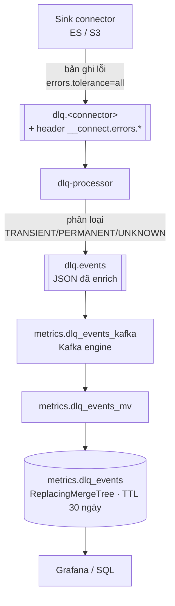

# DLQ processor & fraud-notifier

> Luồng xử lý bản ghi lỗi của Kafka Connect: từ chỗ **biến mất không dấu vết** thành **dữ liệu truy
> vấn được** trong ClickHouse. Thiết kế: [ADR-0017](../decisions/0017-dlq-flow-observe-then-park.md).
> Nguồn: [`dlq-processor/`](../../dlq-processor/), [`clickhouse/init/03_dlq.sql`](../../clickhouse/init/03_dlq.sql).
> Cập nhật lần cuối: 2026-07-16.

---

## 1. Luồng đầy đủ



**Vì sao đi qua Kafka thay vì để processor INSERT thẳng ClickHouse?** DLQ event là thứ ta cần nhất
đúng lúc hệ thống đang hỏng. Nếu ClickHouse cũng đang sập mà ta INSERT thẳng, ta **mất bản ghi lỗi
ngay tại thời điểm cần nó nhất**. Qua Kafka thì chúng nằm chờ. Đây cũng đúng pattern đã chốt ở
[ADR-0007](../decisions/0007-clickhouse-kafka-engine-serving.md).

---

## 2. Cấu hình DLQ trên connector

**Sinh tự động** từ contract — không sửa tay ([ADR-0015](../decisions/0015-metadata-registry-yaml-first.md)):

```json
"errors.tolerance": "all",
"errors.deadletterqueue.topic.name": "dlq.es-sink-transactions",
"errors.deadletterqueue.topic.replication.factor": "1",
"errors.deadletterqueue.context.headers.enable": "true",
"errors.log.enable": "true",
"errors.log.include.messages": "false"
```

| Cấu hình | Vì sao |
|---|---|
| `errors.tolerance: all` | Chuyển bản ghi lỗi sang DLQ thay vì để task **chết**. Mặc định `none` = một message hỏng làm đứng cả connector. |
| `context.headers.enable: true` | **Bắt buộc.** Thiếu nó → không có header `__connect.errors.*` → mọi lỗi thành `UNKNOWN` → phân loại vô nghĩa. |
| `errors.log.include.messages: false` | **Cố ý.** Nó in nội dung bản ghi ra log, mà `customers` chứa `full_name`/`email`/`phone`. Log không phải chỗ cho PII. |

> ⚠️ **`errors.tolerance: all` chỉ an toàn khi có người nhìn.** Nó biến "task chết ồn ào" thành "bản
> ghi lặng lẽ sang DLQ". Không ai xem `metrics.dlq_events` thì đây là **bước lùi** so với fail-fast.
> Việc còn nợ: dashboard Grafana + cảnh báo khi DLQ tăng đột biến.

Danh sách 6 topic DLQ nằm ở [`dlq-processor/dlq_topics.json`](../../dlq-processor/dlq_topics.json) —
**file sinh tự động**, đừng sửa tay. Sinh lại: `python -m dataplatform.cli write`.

---

## 3. Ba nhóm lỗi

| Nhóm | Ví dụ | Ý nghĩa | Hành động |
|---|---|---|---|
| `TRANSIENT` | `ConnectException`, `SocketTimeoutException`, ES `ResponseException` | Hạ tầng tạm thời — sửa xong thì phát lại có ý nghĩa | `PARKED` |
| `PERMANENT` | `DataException`, `SerializationException`, `SchemaException` | Dữ liệu/schema hỏng — thử lại bao nhiêu lần cũng hỏng y hệt | `PARKED` |
| `UNKNOWN` | mọi thứ khác | Chưa phân loại được | `PARKED` |

## 4. ⚠️ Vì sao KHÔNG tự động phát lại

Bản trước của `dlq_processor.py` tự động replay lỗi TRANSIENT về **topic gốc**. Đó là **ba lỗi chồng
nhau**, và bật nó lên sẽ **chủ động làm hỏng dữ liệu**:

| Lỗi | Hậu quả |
|---|---|
| Replay về topic gốc | `bankdb.public.transactions` cũng là nguồn của Flink → giao dịch **bị đếm lại** → sai dashboard |
| Mất `key` | ES `extractKey` cần key làm `_id` → fail lại → quay về DLQ → **vòng lặp vô tận** |
| Không giới hạn số lần | ES sập 1 tiếng → replay quay vòng cháy CPU |

Đích phát lại **đúng** phải là topic chỉ connector đó đọc. Topic gốc không thoả. Topic retry riêng thì
vướng: ES sink lấy **tên index** từ tên topic, S3 sink lấy **đường dẫn partition** từ tên topic → mỗi
connector cần `RegexRouter` riêng. Đó là việc riêng, chưa làm.

Mất mát ít hơn tưởng: Kafka Connect **đã tự retry vài lần trước khi** đẩy vào DLQ, nên phần lớn lỗi
thoáng qua đã được xử lý trước khi tới đây.

---

## 5. Truy vấn

```sql
-- Lỗi gần nhất
SELECT detected_at, connector_name, category, error_class, error_stage, error_message
FROM metrics.dlq_events ORDER BY detected_at DESC LIMIT 20;

-- Đếm theo connector và nhóm
SELECT connector_name, category, count() AS n
FROM metrics.dlq_events GROUP BY connector_name, category ORDER BY n DESC;

-- Lỗi dữ liệu cần người xem
SELECT * FROM metrics.dlq_events WHERE category = 'PERMANENT' ORDER BY detected_at DESC;

-- Nhóm UNKNOWN nhiều = nên bổ sung phân loại trong dlq_processor.py
SELECT error_class, count() AS n FROM metrics.dlq_events
WHERE category = 'UNKNOWN' GROUP BY error_class ORDER BY n DESC;
```

### 5.1 Hai vị trí — đừng trộn

| Cột | Ý nghĩa |
|---|---|
| `dlq_partition`, `dlq_offset` | Vị trí trong **topic DLQ** → khoá chống trùng |
| `original_partition`, `original_offset` | Vị trí trong **topic gốc** → **để tìm lại bản ghi mà phát lại** |

Tìm lại bản ghi gốc đã lỗi:
```bash
docker exec -it bigdata-kafka kafka-console-consumer --bootstrap-server kafka:9092 \
  --topic bankdb.public.transactions --partition 2 --offset 99 --max-messages 1
```

> `message_key` được lưu, **nội dung message thì không** — nó đã nằm nguyên trong topic DLQ. Chép sang
> ClickHouse là nhân bản PII thêm một chỗ, giữ 30 ngày, không thêm giá trị điều tra.

---

## 6. Khởi tạo & vận hành

```bash
# 1. Tạo bảng (clickhouse/init KHÔNG tự chạy — xem clickhouse-grafana.md)
docker exec -i bigdata-clickhouse clickhouse-client --user admin \
  --password "$CLICKHOUSE_PASSWORD" --multiquery < clickhouse/init/03_dlq.sql

# 2. Sinh lại config + bản kê nếu contract đổi, rồi rebuild
python -m dataplatform.cli write
docker compose up -d --build dlq-processor

# 3. Theo dõi
docker logs -f bigdata-dlq-processor
```

**Ép ra lỗi để thử:** dừng Elasticsearch (`docker compose stop elasticsearch`) trong khi CDC đang chảy
→ ES sink lỗi → bản ghi vào `dlq.es-sink-*` → xuất hiện trong `metrics.dlq_events`.

| Triệu chứng | Nguyên nhân |
|---|---|
| Processor chết lúc khởi động, báo thiếu `dlq_topics.json` | Chưa chạy `python -m dataplatform.cli write` |
| Mọi lỗi đều `UNKNOWN` | Connector thiếu `context.headers.enable=true` |
| `dlq_events` rỗng nhưng `dlq.events` có message | Bảng chưa tạo, hoặc cột lệch → MV bỏ dòng **không báo lỗi** |
| `original_offset = -1` | Header không có → connector chưa bật `context.headers.enable` |

---

## 7. fraud-notifier — vẫn còn nợ

[`fraud_notifier.py`](../../fraud-notifier/fraud_notifier.py) consume `fraud-alerts` → gửi email SMTP.

| Cấu hình | Giá trị |
|---|---|
| `group_id` / offset | `fraud-notifier-v2` / `earliest` |
| Gửi khi severity | `HIGH` hoặc `MEDIUM` |
| Cooldown | **300 giây mỗi account** — chống spam |
| SMTP | `.env`: `SMTP_HOST`/`SMTP_PORT`, Gmail cần **App Password** |

**Phần chạy được:** đọc alert, format, gửi email.

**Phần chưa:** `write_to_clickhouse()` INSERT vào `metrics.notification_events` — **bảng không tồn
tại**, lỗi bị nuốt trong `try/except`. Cùng loại lỗi với DLQ trước đây, chưa xử lý. ADR-0012 vẫn đúng
ở điểm này.

Không thấy email? Đi ngược: (1) topic `fraud-alerts` có message chưa (Lane 3 đã submit?) → (2) alert có
`severity` `HIGH`/`MEDIUM` không (`LOW` **không** gửi) → (3) account có đang trong cooldown 300s? →
(4) SMTP xác thực được không (xem log).
