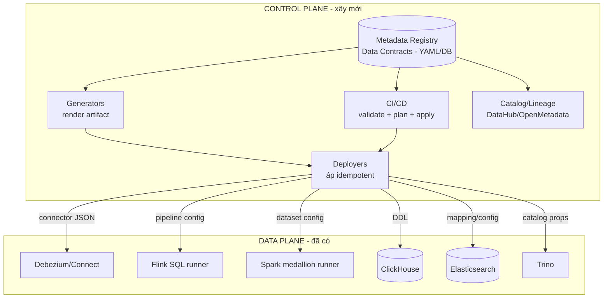
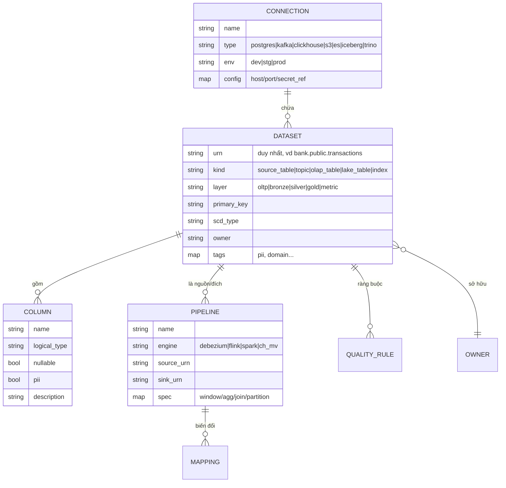

# Lộ trình chuyển sang Metadata-Driven (production)

> Kế hoạch hành động. Đọc [`../architecture/BDP-current-state.md`](../architecture/BDP-current-state.md)
> trước để hiểu vấn đề "metadata sprawl" mà lộ trình này giải quyết.
> Quyết định chọn hướng này: [ADR-0014](../decisions/0014-adopt-metadata-driven-roadmap.md).
> Cập nhật lần cuối: 2026-07-15.

---

## 1. "Metadata-driven" ở hệ thống này nghĩa là gì

**Nguyên tắc:** khai báo mỗi thực thể/pipeline **một lần duy nhất** dưới dạng dữ liệu (metadata / data
contract), rồi **sinh ra** mọi artifact vận hành từ đó, thay vì viết tay và sao chép ở từng công cụ.

| Trước (imperative, hardcode) | Sau (declarative, metadata-driven) |
|---|---|
| 6 file Flink lặp `ROW<...>` | 1 contract → 1 engine Flink tổng quát sinh DDL |
| 5 file JSON ES sink viết tay | Sinh từ danh sách entity |
| 12 khối schema ClickHouse | Sinh từ spec của metric |
| Thêm cột = sửa ~6 file | Thêm cột = sửa 1 contract, chạy generator |
| Áp cấu hình bằng tay | CI/CD "plan → apply" như Terraform |

**Hai mặt phẳng cần tách bạch:**

- **Control plane** — metadata registry + generators + deployers + CI/CD. Nơi "sự thật" sống. *Phần
  xây mới.*
- **Data plane** — Kafka, Flink, Spark, ClickHouse, ES, Trino. Giữ nguyên engine, nhưng chúng được
  **cấu hình bởi** control plane.



---

## 2. Kiến trúc đích của metadata

### 2.1 Mô hình metadata



### 2.2 Định dạng & nơi lưu

- **Giai đoạn đầu (khuyến nghị bắt đầu ở đây):** **data contract dạng YAML** trong thư mục
  `metadata/`, version bằng Git. Đơn giản, review bằng PR, không cần hạ tầng mới.
- **Khi mở rộng:** đưa metadata vào một **registry service** (Postgres + REST/GraphQL API) và/hoặc
  **catalog chuẩn ngành** (OpenMetadata / DataHub) để có UI, lineage, discovery, RBAC.

> Nguyên tắc: **Git là nguồn sự thật, catalog là nơi tra cứu.** Không sửa metadata trực tiếp trên
> catalog để tránh drift.

### 2.3 Cấu trúc thư mục đề xuất

```text
metadata/
  connections/         # 1 file / hệ thống (postgres, kafka, clickhouse, es, s3, iceberg, trino)
  datasets/
    oltp/              # customers, accounts, transactions, transfers
    metrics/           # timeseries, kpi, breakdown, topn
    lake/              # bronze/silver/gold datasets
  pipelines/
    cdc/               # debezium + publication
    stream/            # flink metric pipelines, fraud
    batch/             # spark bronze->silver->gold
    serving/           # clickhouse mv, es sinks, s3 sink
  quality/             # rule chất lượng theo dataset
dataplatform/          # KHÔNG đặt tên `platform/` — trùng module stdlib, xem ADR-0016
  registry.py          # đọc + validate contract
  cli.py               # check / write / show
  schemas/             # JSON Schema để validate chính metadata
  generators/          # code render artifact từ metadata
  deployers/           # code áp artifact (idempotent)
  runtime/
    flink_runner/      # engine Flink SQL tổng quát đọc pipeline spec
    spark_runner/      # engine Spark medallion tổng quát
```

> **Đã sửa so với bản đầu:** thư mục này ban đầu được đề xuất là `platform/`. Đó là tên của một module
> chuẩn trong Python — biến nó thành package sẽ che mất stdlib và làm hỏng mọi thư viện gọi
> `import platform`. Xem [ADR-0016](../decisions/0016-rename-platform-to-dataplatform.md).

---

## 3. Ví dụ cụ thể — một contract sinh ra nhiều artifact

Đây là phần làm cho ý tưởng "chạm được". Một file duy nhất mô tả `transactions`:

```yaml
# metadata/datasets/oltp/transactions.yaml
urn: bank.public.transactions
kind: source_table
layer: oltp
owner: team-core-banking
connection: postgres_main
primary_key: transaction_id
cdc:
  enabled: true
  replica_identity: default          # accounts/transfers = full
topic: bankdb.public.transactions    # suy ra được từ prefix + schema + table
columns:
  - {name: transaction_id,   type: long,          nullable: false, pk: true}
  - {name: account_id,       type: long,          nullable: false}
  - {name: transaction_type, type: string,        nullable: false}
  - {name: amount,           type: decimal(19,4), nullable: false, encoded_as: string}
  - {name: currency,         type: string,        nullable: false}
  - {name: status,           type: string,        nullable: false}
  - {name: posted_at,        type: timestamp}
tags: [banking, fact]
```

Từ **một** file trên, generator sinh ra **tất cả** những thứ hôm nay đang viết tay:

**(a) Flink source DDL** — thay cho `ROW<...>` copy-paste ở 6 file:
```sql
CREATE TABLE transactions_source (
  op STRING, ts_ms BIGINT,
  `after` ROW<transaction_id BIGINT, account_id BIGINT, transaction_type STRING,
              amount STRING, currency STRING, status STRING>,
  event_time AS TO_TIMESTAMP_LTZ(ts_ms, 3),
  WATERMARK FOR event_time AS event_time - INTERVAL '5' SECOND
) WITH ('connector'='kafka', 'topic'='bankdb.public.transactions', ...);
```

**(b) ES sink JSON** — thay cho `es-sink-transactions.json` viết tay:
```json
{"name":"es-sink-transactions","config":{
  "topics":"bankdb.public.transactions",
  "transforms.extractKey.field":"transaction_id", ...}}
```

**(c) Debezium `table.include.list`** — gộp từ mọi dataset có `cdc.enabled: true`:
```text
"table.include.list": "public.customers,public.accounts,public.transactions,public.transfers"
```

**(d) Publication DDL, S3 sink `topics`, danh sách DLQ topic, Trino catalog** — tất cả đều là *view*
của cùng tập metadata.

Và một file spec mô tả pipeline streaming:

```yaml
# metadata/pipelines/stream/timeseries.yaml
name: metric_timeseries
engine: flink
source_urn: bank.public.transactions
sink_urn: metric.timeseries
window: {type: tumble, size: 1m, time_col: event_time}
group_by: [transaction_type]
filter: "op = 'c'"
aggregations:
  - {as: tx_count,     expr: "COUNT(*)"}
  - {as: total_amount, expr: "SUM(CAST(after.amount AS DECIMAL(19,4)))"}
```

→ sinh đồng thời: INSERT SQL cho Flink runner **và** 3 khối DDL ClickHouse (target + Kafka engine +
MV). **Cùng một spec đảm bảo schema Flink output == schema ClickHouse input** — hết lỗi lệch cột
âm thầm.

---

## 4. Lộ trình 9 pha

> Chiến lược tổng thể: **strangler-fig**. Với mỗi thành phần: (1) mã hóa hiện trạng thành metadata →
> (2) sinh artifact → (3) đối chiếu (diff) artifact sinh vs viết tay → (4) cắt chuyển → (5) xóa file
> viết tay. Không dừng hệ thống.

### Pha 0 — Nền tảng & rào chắn an toàn *(bắt buộc trước tiên)*

**Mục tiêu:** làm sạch để có thể tự động hóa an toàn.

1. **Vá các khoảng trống chức năng** ([`BDP-current-state.md`](../architecture/BDP-current-state.md) §4.1).
   Tự động hoá trên nền còn hỏng chỉ làm chỗ hỏng lan nhanh hơn.
   - ✅ **Xong** — nối DLQ đầy đủ + tạo `metrics.dlq_events`
     ([ADR-0017](../decisions/0017-dlq-flow-observe-then-park.md)). Kèm phát hiện: logic replay cũ
     gửi bản ghi lỗi về **topic gốc**, làm Flink đếm lại giao dịch → bật DLQ nguyên trạng sẽ **hỏng
     dữ liệu metric**. Đã bỏ auto-replay.
   - ⬜ Mount `clickhouse/init` vào entrypoint (nay đã có **3** file init phải chạy tay).
   - ⬜ Tạo bucket `data-lake-*` trong `minio-init`.
   - ⬜ Tạo `metrics.notification_events` hoặc bỏ phần ghi ClickHouse của `fraud-notifier`.
   - ⬜ Gỡ print sink trong `lane3_fraud_detection.py`.
   - ⬜ **Dashboard + cảnh báo DLQ.** Nợ mới do ADR-0017 tạo ra: `errors.tolerance=all` khiến connector
     lỗi vẫn báo `RUNNING`. Không ai nhìn `metrics.dlq_events` thì đây là **bước lùi** so với fail-fast.
2. **Secrets:** chuyển sang **SOPS + age** (đơn giản, hợp Git) hoặc **Vault** (nếu cần động). Metadata
   chỉ tham chiếu `secret_ref`, không chứa giá trị. Thêm bước **quét secret trong CI**.
   *(`.env` đã được gitignore và chưa từng commit — đây là việc cải thiện, không phải xử lý sự cố.)*
3. **Chuẩn hóa môi trường:** tách `dev/stg/prod`; mỗi connection có config theo env.
4. **Đặt quy ước tên:** URN dataset, tên topic, tên connector, `group.id` — viết thành tài liệu ngắn
   để generator tuân theo.
5. **Dọn nợ:** xóa 4 job Flink trùng (`lane1_{kpi,timeseries,breakdown,topn}.py`), thống nhất CRLF/LF.
6. **Khởi tạo CI trống:** pipeline chạy lint/format.

**Đầu ra:** repo sạch, secrets có quản lý, quy ước rõ ràng. **Ước lượng:** 3–5 ngày.

---

### Pha 1 — Định nghĩa mô hình metadata & mã hóa hiện trạng

**Mục tiêu:** có `metadata/` mô tả *đúng* hệ thống đang chạy (reverse-engineering).

1. ✅ Viết **JSON Schema** cho chính metadata (`dataplatform/schemas/`) — "meta-metadata".
2. 🟡 Mã hóa dataset thành YAML như ví dụ §3:
   - ✅ 4 dataset OLTP (`customers`, `accounts`, `transactions`, `transfers`)
   - ✅ `fraud-alerts` (ngoài danh sách gốc — cần để chứng minh mô hình chịu được dataset khác khuôn)
   - ✅ **4 metric** (`metrics.{timeseries,kpi,breakdown,topn}`) — [ADR-0019](../decisions/0019-generate-clickhouse-metric-ddl.md).
     Mở khoá topic manifest (Pha 2) và đã dùng để sinh DDL ClickHouse (Pha 4).
   - ⬜ Các dataset lake (bronze/silver/gold) — cần cho Pha 5.
3. 🟡 Mã hóa connections — `metadata/connections/*.yaml` là contract hạng nhất ([ADR-0025](../decisions/0025-connection-registry-trino-catalog.md)).
   ✅ 3 connection Trino (postgres, clickhouse, iceberg) → sinh catalog. ⬜ Còn kafka, s3, es, schema-registry.
4. ✅ **Kiểm chứng ngược** (bộ ba nguồn sự thật độc lập) — [ADR-0022](../decisions/0022-reverse-verify-contract-vs-real-schema.md):
   - ✅ `verifiers/postgres_schema` — bảng NGUỒN, so `information_schema` (tên/kiểu/nullable/PK): 4/4 khớp.
   - ✅ `verifiers/avro_schema` — TRÊN DÂY, so Avro trong Schema Registry (`encoded_as: string` = decimal
     mã hoá string): phần kiểm được khớp (bảng rỗng thì bỏ qua tới khi có data).
   - ✅ `verifiers/clickhouse_schema` — bảng ĐÍCH, so `system.columns` (bắt drift thủ công, tái dùng `_ch_type`): 4/4 khớp.
   - Cả ba chứng minh hai chiều (test âm bắt lỗi tiêm). Nợ ẩn "contract lệch nguồn thật" **chứng minh không tồn tại**.
   - Lưu ý: verifier cần stack chạy → thuộc CI có stack ephemeral (Pha 7), không vào CI tĩnh.

**Đầu ra:** `metadata/` là bản sao chính xác của hệ thống; validator chạy trong CI.
**Ước lượng:** 1–1.5 tuần.

---

### Pha 2 — Sinh tầng Ingestion *(quick win, ROI cao nhất)*

**Mục tiêu:** connector & topic sinh từ metadata. Đây là nơi trùng lặp nhiều và dễ tự động hóa nhất →
làm trước để chứng minh giá trị.

1. Generator sinh các artifact ingestion:
   - ✅ 5 file `es-sink-*.json` (topic + `extractKey.field` = PK từ contract) — [ADR-0015](../decisions/0015-metadata-registry-yaml-first.md)
   - ✅ `s3-sink-cdc.json` (`topics` gộp từ mọi dataset bật `s3_bronze`)
   - ✅ Cấu hình DLQ cho cả 6 connector + bản kê topic cho `dlq-processor` — [ADR-0017](../decisions/0017-dlq-flow-observe-then-park.md)
   - ✅ `postgres-connector.json` (`table.include.list`) **và** `04_publication.sql` — sinh từ **cùng
     một nguồn** nên không thể lệch; diệt sprawl #2/#3 ([ADR-0018](../decisions/0018-generate-debezium-and-publication.md)).
   - ✅ **Topic manifest + cutover** — sinh `kafka/topics.json` + `kafka/create-topics.sh` từ registry
     (gộp dataset + DLQ tái dùng `dlq.py` + hạ tầng `dlq.events`/`_connect_*`/`_schemas`/
     `__debezium-heartbeat`). **Đã cắt chuyển end-to-end:** service `kafka-init` tạo topic khi khởi động,
     `auto.create.topics=false`, chứng minh live (21/21 topic khớp, topic ma không bị tạo, pipeline vẫn
     chảy). Đối chiếu-với-thật lôi ra `_schemas`, `__debezium-heartbeat`, lỗi CRLF — [ADR-0020](../decisions/0020-generate-kafka-topic-manifest.md).
2. ✅ **Deployer** áp connector qua Connect REST **idempotent** (`PUT /connectors/{name}/config`), có
   `plan`/`apply`, đọc thẳng generator, không chạm secret. 7 connector deploy + RUNNING, idempotency
   chứng minh — [ADR-0021](../decisions/0021-connector-deployer-idempotent.md). Hết cảnh `curl` thủ công.
3. ✅ Đối chiếu JSON sinh vs JSON hiện tại (diff = rỗng) — `python -m dataplatform.cli check`, 13/13 khớp.
   ✅ **Cắm `check` vào CI** — GitHub Actions `metadata-check.yml` chạy `check` trên mọi PR + push main;
   sửa contract mà quên generator thì CI **đỏ**. Chứng minh hai chiều: tree sạch → exit 0; chèn drift giả
   → exit 1; khôi phục → exit 0. (`deployers ... plan` cần Connect sống nên để CI có stack ephemeral —
   Pha 7.)

**Đầu ra:** thêm/bớt bảng CDC = sửa 1 contract → generator → deployer, drift bị CI chặn. **Pha 2 xong**
phần cốt lõi (còn compatibility gate Avro để trọn vẹn — Pha 7).

---

### Pha 3 — Flink runner tổng quát

**Mục tiêu:** thay 6 job hardcode bằng **1 engine đọc pipeline spec**.

1. 🟡 `flink_runner` (**cấu trúc khai báo hoàn toàn** — [ADR-0023](../decisions/0023-flink-metric-runner-declarative.md)):
   ✅ 4 pipeline spec (`metadata/pipelines/stream/*.yaml`) khai window/filter/dimensions/aggregations/rank;
   ✅ `generators/flink_sql.py` sinh source DDL (từ cột tham chiếu — diệt sprawl #6, loại cột chết) + sink
   DDL (từ contract metric — diệt nửa Flink #8) + INSERT; ✅ runner mỏng `metric_runner.py` thực thi job
   plan; ✅ **oracle SQL**: SQL sinh tương đương SQL viết tay lane1; ✅ **runtime**: submit RUNNING (mọi
   vertex, kể cả WindowRank cho topn); ✅ **parity ground truth**: seed data → cả 4 metric (TUMBLE +
   CUMULATE) khớp tuyệt đối trong Kafka + ClickHouse; ✅ **cắt chuyển: xoá `lane1_dashboard.py`**; ✅
   deployer `flink_metrics` (`plan`/`apply`).
2. ✅ Fraud (`fraud_runner.py`): **giữ detector là code** (velocity, failed-storm), nhưng source DDL +
   ngưỡng/cửa sổ/topic **sinh** từ `fraud.yaml` (diệt nốt sprawl #6); bỏ `ds.print` spam (gap #6).
   Chứng minh runtime: seed 8 giao dịch/account → alert `VELOCITY_FRAUD tx_count=8` khớp ground truth.
3. ✅ Đối chiếu + cắt chuyển: runner chạy song song (group riêng), parity ground truth → **xoá
   `lane1_dashboard.py` + `lane3_fraud_detection.py`**. Deployer `flink_metrics` submit cả hai.

**Pha 3 XONG.** Ghi chú vận hành: Flink session job **không sống sót qua restart jobmanager** (single-node,
không HA — gap #7). Nhưng recovery nay là **một lệnh**: `connectors apply` + `flink_metrics apply` dựng lại
toàn bộ từ metadata (đã kiểm khi stack bị cycle giữa chừng). Auto-resubmit lúc khởi động = orchestration Pha 7.

**Đầu ra:** thêm 1 metric = thêm 1 file YAML, không viết Python mới. **Ước lượng:** 2.5–3 tuần.

---

### Pha 4 — Sinh tầng Serving ClickHouse

**Mục tiêu:** hết cảnh 12 khối schema viết tay; đảm bảo khớp với Flink.

1. ✅ Từ **mỗi metric dataset**, sinh cả 3: `metrics.<m>` (engine/ORDER BY/TTL từ metadata),
   `metrics.<m>_kafka` (Kafka engine), `metrics.<m>_mv` — cả 3 đọc **cùng một `columns`** nên không thể
   lệch. Kiểm chứng bằng cách áp DDL thật vào ClickHouse: **12/12 đối tượng giống hệt** bản viết tay
   ([ADR-0019](../decisions/0019-generate-clickhouse-metric-ddl.md)).
2. 🟡 **Nửa còn lại của sprawl #8:** sink DDL bên Flink (`lane1_dashboard.py`) **vẫn viết tay** → vẫn có
   thể lệch với ClickHouse. Chỉ hết khi Flink runner sinh cả hai đầu từ cùng spec (**Pha 3**).
3. ⬜ Áp DDL qua **migration có version** (xem Pha 7) thay vì init script chạy một lần.

> **Ghi chú thứ tự:** Pha 4 làm **trước** Pha 3, vì Pha 4 rủi ro "Trung bình" và **có oracle** (12 bảng
> đang chạy để đối chiếu), còn Pha 3 rủi ro "Cao". Làm cái chắc chắn trước.

**Đầu ra:** đổi metric = sửa contract, DDL tự cập nhật, không lệch. **Ước lượng:** 1–1.5 tuần
*(phần ClickHouse đã xong)*.

---

### Pha 5 — Spark medallion runner tổng quát

**Mục tiêu:** Bronze→Silver→Gold tham số hóa bằng metadata.

**Hướng đã chốt:** SQL trong spec (mô hình **dbt**), không cấu-trúc-hoàn-toàn — vì ETL medallion **khác
khuôn** (dedup/join/agg/filter), khác Flink metric đồng khuôn. Xem [ADR-0024](../decisions/0024-spark-medallion-runner-sql.md).

1. 🟡 `medallion_runner` (mỏng) + `deployers/spark_batch` (`plan`/`apply` theo thứ tự layer):
   - ✅ **Silver** — batch spec `silver_enriched_transactions.yaml` (inputs + SQL dedup+join 3 chiều +
     output schema/partition). **Parity: 72 = 72 rows** với `enrich_transactions.py`; đã xoá job cũ.
   - ✅ **Gold** (3 spec) — parity tuyệt đối với `build_gold_layer.py`: daily **339=339**, customer
     **100=100**, high_risk **310=310** (cùng Silver 1072). Đã xoá job cũ.
   - ✅ **Iceberg** (`output.format=iceberg` → runner CTAS + catalog REST) — `lakehouse.silver.enriched_transactions`
     1072 rows, 1 snapshot, query được. Đã xoá `silver_to_iceberg.py`. Lôi ra bẫy scheme `s3://` vs `s3a`
     (fix `fs.s3.impl=S3AFileSystem`).
2. ✅ Đối chiếu row count Silver + Gold + Iceberg. ⬜ Verifier schema output vs `output.columns` (Pha 6/7).

> **Pha 5 XONG.** Thêm bảng lake = 1 batch spec (contract + SQL), không Python. 3 job Spark hardcode đã xoá.

**Đầu ra:** thêm bảng lake = 1 batch spec. Chạy toàn bộ: `python -m dataplatform.deployers.spark_batch apply`
(silver → 3 gold → iceberg, theo thứ tự phụ thuộc). **Ước lượng:** 2–2.5 tuần *(đã xong)*.

---

### Pha 6 — Federation & Catalog/Lineage

1. 🟡 Sinh `trino/etc/catalog/*.properties` từ **connection registry**.
   - ✅ **Connection registry** (`metadata/connections/*.yaml`) — đóng nợ Pha 1 (connection nay là contract
     hạng nhất, không còn tên treo lơ lửng). 3 connection Trino: postgres, clickhouse, iceberg.
   - ✅ Generator `trino_catalog.py` — sinh 3 catalog, **oracle byte-exact khớp bản viết tay** (`check` 16/16);
     diệt sprawl #13 ([ADR-0025](../decisions/0025-connection-registry-trino-catalog.md)). Secret vẫn `${ENV:...}`.
   - ✅ Federation runtime verify: `postgres.transactions=1046`, `clickhouse.metrics.timeseries=7` (khớp nguồn).
     Iceberg load được nhưng query treo (nợ runtime Trino↔iceberg↔MinIO, không phải file). ⬜ encode connection non-Trino.
2. ✅ **Lineage + catalog** — `generators/lineage.py` sinh `lineage/graph.json` + `LINEAGE.md` THUẦN từ
   metadata ([ADR-0026](../decisions/0026-lineage-catalog-from-metadata.md)): sơ đồ dòng chảy chéo engine,
   catalog owner/PII, **lineage cột (Flink)**. `check` 18/18.
   ✅ **OpenMetadata UI** — chọn OpenMetadata (không DataHub, [ADR-0027](../decisions/0027-openmetadata-catalog.md));
   `deployers/openmetadata.py` nạp `graph.json` (**24 table** = 9 dataset + 5 lake + 10 sink ngoài, tag PII,
   **đủ 25 cạnh lineage**), verify qua API. Máy 15.3GB đủ khi tạm dừng stack chính (OM ~3GB). ✅ tạo table cho
   đích sink ES/CH/S3 (lineage không còn cụt). ⬜ Lineage cột Spark (parse SQL).
3. ✅ Trả lời được (qua `LINEAGE.md`): "cột `amount` chảy tới đâu?", "dataset nào chứa PII?", "ai sở hữu?".
   Đã lôi ra: PII customers/accounts **chảy vào Silver lake**.

**Đầu ra:** discovery + lineage tự động. **Ước lượng:** 1.5–2 tuần *(catalog/lineage cốt lõi xong; còn UI + lineage cột Spark)*.

---

### Pha 7 — Orchestration, CI/CD & Governance

1. **Orchestration (Airflow/Dagster):** DAG **sinh từ phụ thuộc dataset** (bronze → silver → gold). Có
   lịch, retry, backfill, SLA.
2. **CI/CD "plan → apply"**: PR sửa contract → CI **validate** (JSON Schema) + **compatibility gate**
   (Avro BACKWARD, chặn breaking change) → CI **render + diff** artifact ("plan") để reviewer thấy
   đúng những gì sẽ đổi → merge → **deployer apply** idempotent, có **rollback**.
3. **Migration có version** cho DDL (ClickHouse/Iceberg) — không init-once.
4. **Data quality gate:** rule trong `metadata/quality/` (not-null, range, uniqueness, freshness) thực
   thi bằng **Great Expectations / Soda**; fail thì chặn promote.
5. **RBAC & audit:** ai được sửa contract nào; mọi thay đổi có dấu vết Git + catalog.

**Đầu ra:** thay đổi dữ liệu = PR có review, gate, rollback, lineage. **Ước lượng:** 2.5–3 tuần.

---

### Pha 8 — Cắt chuyển & vận hành hóa

1. Với từng thành phần: xác nhận artifact sinh chạy ổn định → **xóa file viết tay** tương ứng.
2. Viết **runbook**: thêm cột, thêm bảng, thêm metric, xử lý breaking change, backfill, rollback —
   tất cả quy về "sửa metadata + chạy pipeline".
3. Bàn giao & đào tạo; chốt: hệ thống chỉ còn **một nơi để sửa — `metadata/`**.

**Đầu ra:** hệ thống metadata-driven hoàn chỉnh. **Ước lượng:** 1–1.5 tuần.

---

## 5. Tổng hợp

```mermaid
gantt
    title Lộ trình metadata-driven
    dateFormat X
    axisFormat %s
    section Nền tảng
    Pha 0 An toàn & dọn dẹp      :0, 5
    Pha 1 Mô hình & mã hóa       :5, 10
    section Sinh artifact
    Pha 2 Ingestion (quick win)  :15, 12
    Pha 3 Flink runner           :27, 18
    Pha 4 ClickHouse serving     :45, 9
    Pha 5 Spark medallion        :54, 14
    section Vận hành
    Pha 6 Catalog/Lineage        :68, 12
    Pha 7 CI-CD & Governance     :80, 18
    Pha 8 Cắt chuyển             :98, 9
```



| Pha | Nội dung | Ưu tiên | Rủi ro | Ước lượng |
|---|---|---|---|---|
| 0 | An toàn & dọn dẹp | P0 | Thấp | 3–5 ngày |
| 1 | Mô hình metadata + mã hóa | P0 | Thấp | 1–1.5 tuần |
| 2 | Sinh ingestion | **P1 (quick win)** | Thấp | 1.5–2 tuần |
| 3 | Flink runner tổng quát | P1 | **Cao** | 2.5–3 tuần |
| 4 | Sinh ClickHouse serving | P1 | Trung bình | 1–1.5 tuần |
| 5 | Spark medallion runner | P2 | Cao | 2–2.5 tuần |
| 6 | Catalog/Lineage | P2 | Thấp | 1.5–2 tuần |
| 7 | Orchestration + CI/CD + QA | P1 | Trung bình | 2.5–3 tuần |
| 8 | Cắt chuyển & runbook | P2 | Trung bình | 1–1.5 tuần |

**Tổng:** ~14–20 tuần cho 1–2 kỹ sư. Giá trị đến sớm: **sau Pha 2** đã hết trùng lặp ở tầng ingestion.

---

## 6. Rủi ro & cách giảm thiểu

| Rủi ro | Ảnh hưởng | Giảm thiểu |
|---|---|---|
| Flink DataStream (fraud) khó tổng quát hóa | Pha 3 chậm | Tham số hóa thay vì generalize hoàn toàn; giữ detector là code |
| Generator sinh sai → hỏng hàng loạt | Cao | Bắt buộc bước **diff** artifact sinh vs viết tay trước khi apply; canary theo env |
| Breaking schema change lọt qua | Mất dữ liệu/MV lỗi | **Compatibility gate** trong CI (Avro BACKWARD); block merge |
| Metadata drift (sửa tay trên engine) | Mất single-source-of-truth | Git là nguồn duy nhất; deployer ghi đè; cảnh báo khi phát hiện drift |
| Over-engineering registry sớm | Tốn thời gian | Bắt đầu YAML + Git, chỉ lên catalog/DB khi thật cần |
| Vá khoảng trống §4.1 bị bỏ qua | Tự động hoá khuếch đại lỗi | Pha 0 là điều kiện chặn, không phải tuỳ chọn |

---

## 7. Lựa chọn công cụ (gợi ý, không bắt buộc)

| Nhu cầu | Nhẹ (bắt đầu) | Đầy đủ (mở rộng) |
|---|---|---|
| Nơi lưu metadata | YAML + Git | Postgres + REST API |
| Validate metadata | JSON Schema | + Pydantic models |
| Catalog & lineage | – | OpenMetadata / DataHub |
| Secrets | SOPS + age | HashiCorp Vault |
| Orchestration | cron + script | Airflow / Dagster |
| Data quality | assert đơn giản | Great Expectations / Soda |
| CI/CD | GitHub Actions | + môi trường + approval gate |
| Schema compatibility | Schema Registry sẵn có | + rule BACKWARD/FULL |

---

## 8. Tiêu chí "đã xong" (Definition of Done)

1. ✅ Thêm một **cột** = sửa 1 contract → CI plan/apply → mọi engine cập nhật, không sửa file nào khác.
2. ✅ Thêm một **bảng/metric** = thêm 1 file trong `metadata/`, không viết code engine mới.
3. ✅ Không còn artifact viết tay song song (JSON connector, DDL init, `lane1_*.py`, job Spark cứng).
4. ✅ Mọi thay đổi qua **PR có review + compatibility gate + quality gate + rollback**.
5. ✅ **Lineage & ownership** tra cứu được tự động cho mọi dataset.
6. ✅ **Không secret nào** ở dạng plaintext ngoài secret manager; CI có quét secret.
7. ✅ Có **runbook** để người mới thao tác chỉ bằng cách sửa metadata.

---

## 9. Bắt đầu từ đâu (tuần đầu tiên)

1. **Vá §4.1** — mount ClickHouse init + tạo bucket lake trong `minio-init`. Rẻ, và chặn được lớp lỗi
   "dashboard rỗng mà không rõ vì sao".
2. Tạo khung thư mục `metadata/` và `platform/schemas/`.
3. Mã hóa **1 dataset** (`transactions`) + **1 metric** (`timeseries`) làm mẫu.
4. Viết generator nhỏ sinh **1 artifact** (ES sink JSON) và **diff** với file hiện tại = rỗng. Đây là
   "hello world" chứng minh mô hình chạy được, rồi nhân rộng theo Pha 2.
