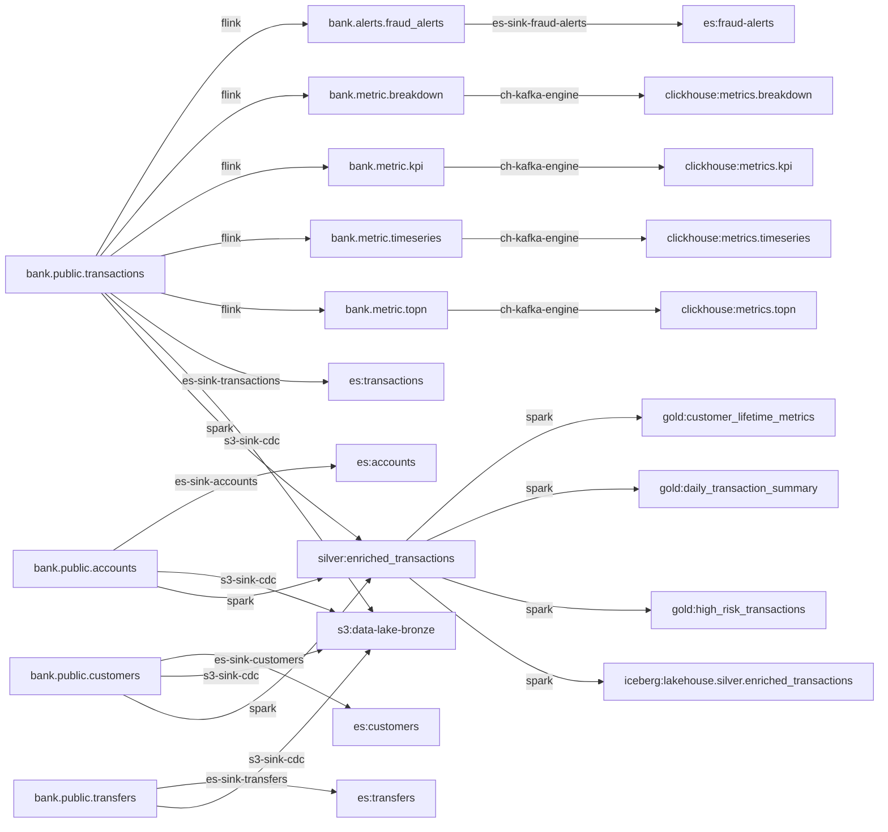

# Lineage & Data Catalog

> FILE SINH TỰ ĐỘNG từ `metadata/` — đừng sửa tay. Sinh lại: `python -m dataplatform.cli write`.

## 1. Sơ đồ dòng chảy dữ liệu

## 2. Data catalog — ai sở hữu, PII ở đâu

| Dataset | Layer | Owner | Cột PII | Tags |
|---|---|---|---|---|
| `bank.alerts.fraud_alerts` | alert | team-fraud | — | fraud, alert, generated |
| `bank.metric.breakdown` | metric | team-analytics | — | metric, realtime, dashboard |
| `bank.metric.kpi` | metric | team-analytics | — | metric, realtime, dashboard |
| `bank.metric.timeseries` | metric | team-analytics | — | metric, realtime, dashboard |
| `bank.metric.topn` | metric | team-analytics | — | metric, realtime, dashboard |
| `bank.public.accounts` | oltp | team-core-banking | account_number | banking, dimension |
| `bank.public.customers` | oltp | team-core-banking | full_name, email, phone | banking, dimension, pii |
| `bank.public.transactions` | oltp | team-core-banking | — | banking, fact, high-throughput |
| `bank.public.transfers` | oltp | team-core-banking | — | banking, fact, lifecycle |

## 3. PII chảy tới đâu

| Dataset PII | Cột | Chảy tới |
|---|---|---|
| `bank.public.accounts` | account_number | es:accounts, s3:data-lake-bronze, silver:enriched_transactions |
| `bank.public.customers` | full_name, email, phone | es:customers, s3:data-lake-bronze, silver:enriched_transactions |

## 4. Lineage cột (Flink metric)

| Cột đầu ra | Từ cột nguồn | Biểu thức |
|---|---|---|
| `bank.metric.breakdown.tx_type` | `bank.public.transactions.transaction_type` | ``after`.transaction_type` |
| `bank.metric.breakdown.tx_count` | — (không cột nguồn cụ thể) | `COUNT(*)` |
| `bank.metric.breakdown.total_value` | `bank.public.transactions.amount` | `SUM(CAST(`after`.amount AS DECIMAL(19, 4)))` |
| `bank.metric.breakdown.success_count` | `bank.public.transactions.status` | `COUNT(*) FILTER (WHERE `after`.status = 'completed')` |
| `bank.metric.breakdown.failed_count` | `bank.public.transactions.status` | `COUNT(*) FILTER (WHERE `after`.status = 'failed')` |
| `bank.metric.kpi.total_count` | — (không cột nguồn cụ thể) | `COUNT(*)` |
| `bank.metric.kpi.total_value` | `bank.public.transactions.amount` | `SUM(CAST(`after`.amount AS DECIMAL(19, 4)))` |
| `bank.metric.kpi.success_count` | `bank.public.transactions.status` | `COUNT(*) FILTER (WHERE `after`.status = 'completed')` |
| `bank.metric.kpi.failed_count` | `bank.public.transactions.status` | `COUNT(*) FILTER (WHERE `after`.status = 'failed')` |
| `bank.metric.kpi.success_rate` | `bank.public.transactions.status` | `CAST(COUNT(*) FILTER (WHERE `after`.status = 'completed') * 100.0 / NULLIF(COUNT(*), 0) AS DECIMAL(5, 2))` |
| `bank.metric.kpi.active_users` | `bank.public.transactions.account_id` | `COUNT(DISTINCT `after`.account_id)` |
| `bank.metric.timeseries.tx_type` | `bank.public.transactions.transaction_type` | ``after`.transaction_type` |
| `bank.metric.timeseries.tx_count` | — (không cột nguồn cụ thể) | `COUNT(*)` |
| `bank.metric.timeseries.total_amount` | `bank.public.transactions.amount` | `SUM(CAST(`after`.amount AS DECIMAL(19, 4)))` |
| `bank.metric.topn.account_id` | `bank.public.transactions.account_id` | ``after`.account_id` |
| `bank.metric.topn.tx_count` | — (không cột nguồn cụ thể) | `COUNT(*)` |
| `bank.metric.topn.total_value` | `bank.public.transactions.amount` | `SUM(CAST(`after`.amount AS DECIMAL(19, 4)))` |
