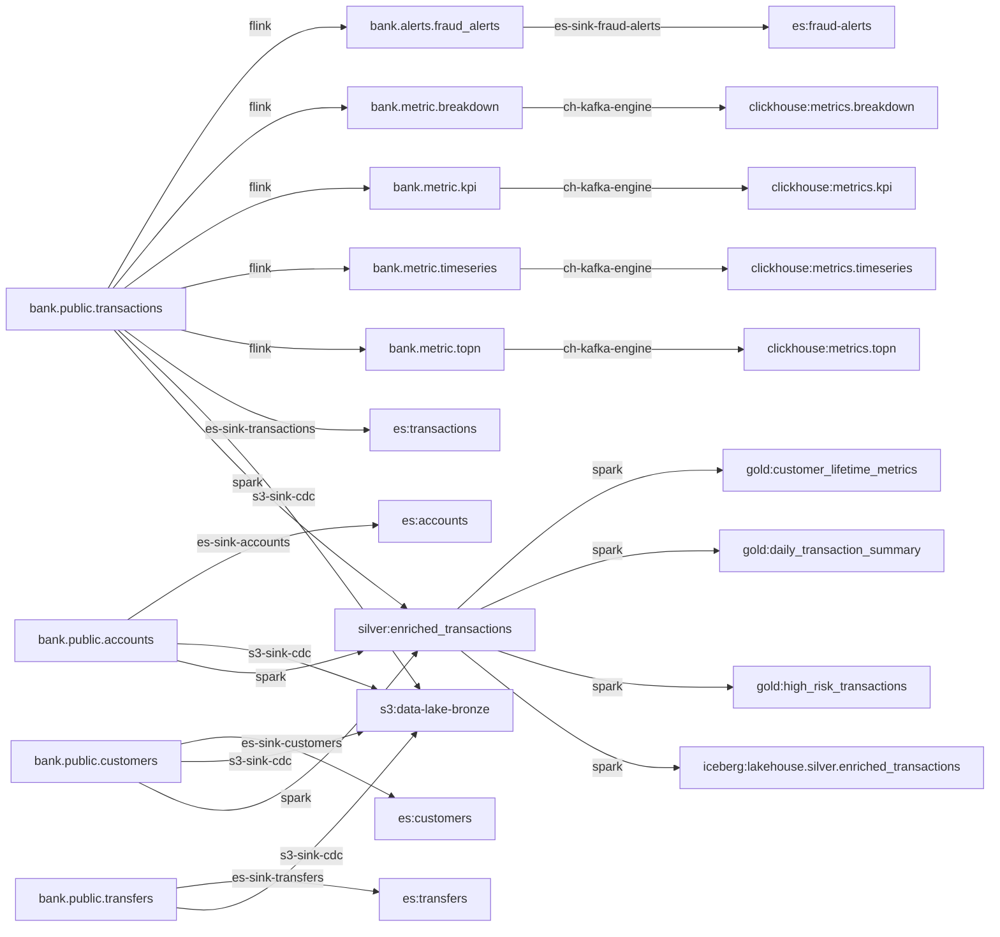

# Lineage & Data Catalog

> FILE SINH TỰ ĐỘNG từ `metadata/` — đừng sửa tay. Sinh lại: `python -m dataplatform.cli write`.

## 1. Sơ đồ dòng chảy dữ liệu

## 2. Data catalog — ai sở hữu, PII ở đâu

| Dataset | Layer | Owner | Cột PII | Tags |
|---|---|---|---|---|
| `bank.alerts.fraud_alerts` | alert | team-fraud | — | fraud, alert, generated |
| `bank.metric.breakdown` | metric | team-analytics | — | metric, realtime, dashboard |
| `bank.metric.kpi` | metric | team-analytics | — | metric, realtime, dashboard |
| `bank.metric.timeseries` | metric | team-analytics | — | metric, realtime, dashboard |
| `bank.metric.topn` | metric | team-analytics | — | metric, realtime, dashboard |
| `bank.public.accounts` | oltp | team-core-banking | account_number | banking, dimension |
| `bank.public.customers` | oltp | team-core-banking | full_name, email, phone | banking, dimension, pii |
| `bank.public.transactions` | oltp | team-core-banking | — | banking, fact, high-throughput |
| `bank.public.transfers` | oltp | team-core-banking | — | banking, fact, lifecycle |

## 3. PII chảy tới đâu

| Dataset PII | Cột | Chảy tới |
|---|---|---|
| `bank.public.accounts` | account_number | es:accounts, s3:data-lake-bronze, silver:enriched_transactions |
| `bank.public.customers` | full_name, email, phone | es:customers, s3:data-lake-bronze, silver:enriched_transactions |

## 4. Lineage cột — cột đầu ra bắt nguồn từ cột nào

### 4.1 Flink (streaming metric) — từ `expr` trong pipeline

| Pipeline | Cột đầu ra | Từ cột nguồn | Biểu thức |
|---|---|---|---|
| metric_breakdown | `bank.metric.breakdown.tx_type` | `bank.public.transactions.transaction_type` | ``after`.transaction_type` |
| metric_breakdown | `bank.metric.breakdown.tx_count` | — (không cột nguồn cụ thể) | `COUNT(*)` |
| metric_breakdown | `bank.metric.breakdown.total_value` | `bank.public.transactions.amount` | `SUM(CAST(`after`.amount AS DECIMAL(19, 4)))` |
| metric_breakdown | `bank.metric.breakdown.success_count` | `bank.public.transactions.status` | `COUNT(*) FILTER (WHERE `after`.status = 'completed')` |
| metric_breakdown | `bank.metric.breakdown.failed_count` | `bank.public.transactions.status` | `COUNT(*) FILTER (WHERE `after`.status = 'failed')` |
| metric_kpi | `bank.metric.kpi.total_count` | — (không cột nguồn cụ thể) | `COUNT(*)` |
| metric_kpi | `bank.metric.kpi.total_value` | `bank.public.transactions.amount` | `SUM(CAST(`after`.amount AS DECIMAL(19, 4)))` |
| metric_kpi | `bank.metric.kpi.success_count` | `bank.public.transactions.status` | `COUNT(*) FILTER (WHERE `after`.status = 'completed')` |
| metric_kpi | `bank.metric.kpi.failed_count` | `bank.public.transactions.status` | `COUNT(*) FILTER (WHERE `after`.status = 'failed')` |
| metric_kpi | `bank.metric.kpi.success_rate` | `bank.public.transactions.status` | `CAST(COUNT(*) FILTER (WHERE `after`.status = 'completed') * 100.0 / NULLIF(COUNT(*), 0) AS DECIMAL(5, 2))` |
| metric_kpi | `bank.metric.kpi.active_users` | `bank.public.transactions.account_id` | `COUNT(DISTINCT `after`.account_id)` |
| metric_timeseries | `bank.metric.timeseries.tx_type` | `bank.public.transactions.transaction_type` | ``after`.transaction_type` |
| metric_timeseries | `bank.metric.timeseries.tx_count` | — (không cột nguồn cụ thể) | `COUNT(*)` |
| metric_timeseries | `bank.metric.timeseries.total_amount` | `bank.public.transactions.amount` | `SUM(CAST(`after`.amount AS DECIMAL(19, 4)))` |
| metric_topn | `bank.metric.topn.account_id` | `bank.public.transactions.account_id` | ``after`.account_id` |
| metric_topn | `bank.metric.topn.tx_count` | — (không cột nguồn cụ thể) | `COUNT(*)` |
| metric_topn | `bank.metric.topn.total_value` | `bank.public.transactions.amount` | `SUM(CAST(`after`.amount AS DECIMAL(19, 4)))` |

### 4.2 Spark (batch medallion) — sqlglot parse SQL, lần qua CTE/join

| Pipeline | Cột đầu ra | Từ cột nguồn | Biểu thức |
|---|---|---|---|
| gold_customer_lifetime_metrics | `gold:customer_lifetime_metrics.customer_id` | `silver:enriched_transactions.customer_id` | `customer_id` |
| gold_customer_lifetime_metrics | `gold:customer_lifetime_metrics.customer_name` | `silver:enriched_transactions.customer_name` | `customer_name` |
| gold_customer_lifetime_metrics | `gold:customer_lifetime_metrics.country_code` | `silver:enriched_transactions.country_code` | `country_code` |
| gold_customer_lifetime_metrics | `gold:customer_lifetime_metrics.kyc_status` | `silver:enriched_transactions.kyc_status` | `kyc_status` |
| gold_customer_lifetime_metrics | `gold:customer_lifetime_metrics.risk_score` | `silver:enriched_transactions.risk_score` | `risk_score` |
| gold_customer_lifetime_metrics | `gold:customer_lifetime_metrics.total_txn_count` | `silver:enriched_transactions.transaction_id` | `COUNT(transaction_id) AS total_txn_count` |
| gold_customer_lifetime_metrics | `gold:customer_lifetime_metrics.lifetime_value` | `silver:enriched_transactions.amount` | `SUM(CAST(amount AS DOUBLE)) AS lifetime_value` |
| gold_customer_lifetime_metrics | `gold:customer_lifetime_metrics.avg_txn_amount` | `silver:enriched_transactions.amount` | `AVG(CAST(amount AS DOUBLE)) AS avg_txn_amount` |
| gold_customer_lifetime_metrics | `gold:customer_lifetime_metrics.last_activity` | `silver:enriched_transactions.posted_at` | `MAX(posted_at) AS last_activity` |
| gold_customer_lifetime_metrics | `gold:customer_lifetime_metrics.first_activity` | `silver:enriched_transactions.posted_at` | `MIN(posted_at) AS first_activity` |
| gold_customer_lifetime_metrics | `gold:customer_lifetime_metrics.account_count` | `silver:enriched_transactions.account_id` | `COUNT(DISTINCT account_id) AS account_count` |
| gold_daily_transaction_summary | `gold:daily_transaction_summary.year` | `silver:enriched_transactions.year` | `year` |
| gold_daily_transaction_summary | `gold:daily_transaction_summary.month` | `silver:enriched_transactions.month` | `month` |
| gold_daily_transaction_summary | `gold:daily_transaction_summary.day` | `silver:enriched_transactions.day` | `day` |
| gold_daily_transaction_summary | `gold:daily_transaction_summary.country_code` | `silver:enriched_transactions.country_code` | `country_code` |
| gold_daily_transaction_summary | `gold:daily_transaction_summary.transaction_type` | `silver:enriched_transactions.transaction_type` | `transaction_type` |
| gold_daily_transaction_summary | `gold:daily_transaction_summary.txn_count` | `silver:enriched_transactions.transaction_id` | `COUNT(transaction_id) AS txn_count` |
| gold_daily_transaction_summary | `gold:daily_transaction_summary.total_volume` | `silver:enriched_transactions.amount` | `SUM(CAST(amount AS DOUBLE)) AS total_volume` |
| gold_daily_transaction_summary | `gold:daily_transaction_summary.avg_amount` | `silver:enriched_transactions.amount` | `AVG(CAST(amount AS DOUBLE)) AS avg_amount` |
| gold_daily_transaction_summary | `gold:daily_transaction_summary.unique_customers` | `silver:enriched_transactions.customer_id` | `COUNT(DISTINCT customer_id) AS unique_customers` |
| gold_daily_transaction_summary | `gold:daily_transaction_summary.failed_count` | `silver:enriched_transactions.status` | `SUM(CASE WHEN status = 'failed' THEN 1 ELSE 0 END) AS failed_count` |
| gold_high_risk_transactions | `gold:high_risk_transactions.transaction_id` | `silver:enriched_transactions.transaction_id` | `transaction_id` |
| gold_high_risk_transactions | `gold:high_risk_transactions.posted_at` | `silver:enriched_transactions.posted_at` | `posted_at` |
| gold_high_risk_transactions | `gold:high_risk_transactions.amount` | `silver:enriched_transactions.amount` | `amount` |
| gold_high_risk_transactions | `gold:high_risk_transactions.currency` | `silver:enriched_transactions.currency` | `currency` |
| gold_high_risk_transactions | `gold:high_risk_transactions.transaction_type` | `silver:enriched_transactions.transaction_type` | `transaction_type` |
| gold_high_risk_transactions | `gold:high_risk_transactions.status` | `silver:enriched_transactions.status` | `status` |
| gold_high_risk_transactions | `gold:high_risk_transactions.customer_id` | `silver:enriched_transactions.customer_id` | `customer_id` |
| gold_high_risk_transactions | `gold:high_risk_transactions.customer_name` | `silver:enriched_transactions.customer_name` | `customer_name` |
| gold_high_risk_transactions | `gold:high_risk_transactions.country_code` | `silver:enriched_transactions.country_code` | `country_code` |
| gold_high_risk_transactions | `gold:high_risk_transactions.risk_score` | `silver:enriched_transactions.risk_score` | `risk_score` |
| gold_high_risk_transactions | `gold:high_risk_transactions.account_id` | `silver:enriched_transactions.account_id` | `account_id` |
| gold_high_risk_transactions | `gold:high_risk_transactions.account_type` | `silver:enriched_transactions.account_type` | `account_type` |
| gold_high_risk_transactions | `gold:high_risk_transactions.year` | `silver:enriched_transactions.year` | `year` |
| gold_high_risk_transactions | `gold:high_risk_transactions.month` | `silver:enriched_transactions.month` | `month` |
| gold_high_risk_transactions | `gold:high_risk_transactions.day` | `silver:enriched_transactions.day` | `day` |
| iceberg_silver_enriched | `iceberg:lakehouse.silver.enriched_transactions.transaction_id` | `silver:enriched_transactions.transaction_id` | `*` |
| iceberg_silver_enriched | `iceberg:lakehouse.silver.enriched_transactions.transaction_type` | `silver:enriched_transactions.transaction_type` | `*` |
| iceberg_silver_enriched | `iceberg:lakehouse.silver.enriched_transactions.amount` | `silver:enriched_transactions.amount` | `*` |
| iceberg_silver_enriched | `iceberg:lakehouse.silver.enriched_transactions.currency` | `silver:enriched_transactions.currency` | `*` |
| iceberg_silver_enriched | `iceberg:lakehouse.silver.enriched_transactions.status` | `silver:enriched_transactions.status` | `*` |
| iceberg_silver_enriched | `iceberg:lakehouse.silver.enriched_transactions.posted_at` | `silver:enriched_transactions.posted_at` | `*` |
| iceberg_silver_enriched | `iceberg:lakehouse.silver.enriched_transactions.account_id` | `silver:enriched_transactions.account_id` | `*` |
| iceberg_silver_enriched | `iceberg:lakehouse.silver.enriched_transactions.account_type` | `silver:enriched_transactions.account_type` | `*` |
| iceberg_silver_enriched | `iceberg:lakehouse.silver.enriched_transactions.account_number` | `silver:enriched_transactions.account_number` | `*` |
| iceberg_silver_enriched | `iceberg:lakehouse.silver.enriched_transactions.customer_id` | `silver:enriched_transactions.customer_id` | `*` |
| iceberg_silver_enriched | `iceberg:lakehouse.silver.enriched_transactions.customer_name` | `silver:enriched_transactions.customer_name` | `*` |
| iceberg_silver_enriched | `iceberg:lakehouse.silver.enriched_transactions.country_code` | `silver:enriched_transactions.country_code` | `*` |
| iceberg_silver_enriched | `iceberg:lakehouse.silver.enriched_transactions.kyc_status` | `silver:enriched_transactions.kyc_status` | `*` |
| iceberg_silver_enriched | `iceberg:lakehouse.silver.enriched_transactions.risk_score` | `silver:enriched_transactions.risk_score` | `*` |
| iceberg_silver_enriched | `iceberg:lakehouse.silver.enriched_transactions.year` | `silver:enriched_transactions.year` | `*` |
| iceberg_silver_enriched | `iceberg:lakehouse.silver.enriched_transactions.month` | `silver:enriched_transactions.month` | `*` |
| iceberg_silver_enriched | `iceberg:lakehouse.silver.enriched_transactions.day` | `silver:enriched_transactions.day` | `*` |
| silver_enriched_transactions | `silver:enriched_transactions.transaction_id` | `bank.public.transactions.transaction_id` | `t.transaction_id` |
| silver_enriched_transactions | `silver:enriched_transactions.transaction_type` | `bank.public.transactions.transaction_type` | `t.transaction_type` |
| silver_enriched_transactions | `silver:enriched_transactions.amount` | `bank.public.transactions.amount` | `t.amount` |
| silver_enriched_transactions | `silver:enriched_transactions.currency` | `bank.public.transactions.currency` | `t.currency` |
| silver_enriched_transactions | `silver:enriched_transactions.status` | `bank.public.transactions.status` | `t.status` |
| silver_enriched_transactions | `silver:enriched_transactions.posted_at` | `bank.public.transactions.posted_at` | `t.posted_at` |
| silver_enriched_transactions | `silver:enriched_transactions.account_id` | `bank.public.accounts.account_id` | `a.account_id` |
| silver_enriched_transactions | `silver:enriched_transactions.account_type` | `bank.public.accounts.account_type` | `a.account_type` |
| silver_enriched_transactions | `silver:enriched_transactions.account_number` | `bank.public.accounts.account_number` | `a.account_number` |
| silver_enriched_transactions | `silver:enriched_transactions.customer_id` | `bank.public.customers.customer_id` | `c.customer_id` |
| silver_enriched_transactions | `silver:enriched_transactions.customer_name` | `bank.public.customers.full_name` | `c.full_name AS customer_name` |
| silver_enriched_transactions | `silver:enriched_transactions.country_code` | `bank.public.customers.country_code` | `c.country_code` |
| silver_enriched_transactions | `silver:enriched_transactions.kyc_status` | `bank.public.customers.kyc_status` | `c.kyc_status` |
| silver_enriched_transactions | `silver:enriched_transactions.risk_score` | `bank.public.customers.risk_score` | `c.risk_score` |
| silver_enriched_transactions | `silver:enriched_transactions.year` | `bank.public.transactions.posted_at` | `YEAR(t.posted_at) AS year` |
| silver_enriched_transactions | `silver:enriched_transactions.month` | `bank.public.transactions.posted_at` | `MONTH(t.posted_at) AS month` |
| silver_enriched_transactions | `silver:enriched_transactions.day` | `bank.public.transactions.posted_at` | `DAYOFMONTH(t.posted_at) AS day` |
